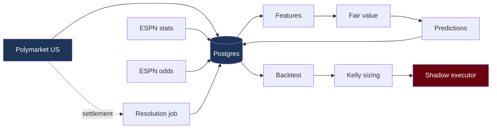

# Meridian

An algorithmic trading system for WNBA prediction markets on **Polymarket US**.

This document is the map of the system: what each piece does, why it exists, what it costs, and what you need to know to work on it. It is written to be read start-to-finish once, then used as reference.

> **📚 Deep dives live in [`docs/`](docs/README.md)** — short, single-topic docs on the [math](docs/README.md#math), the [stack](docs/README.md#stack), and the [infra](docs/README.md#infra). Start with [architecture](docs/infra/architecture.md) → [fair value](docs/math/fair-value.md) → [CLV](docs/math/clv.md).

**Current status:** data layer built and running. Build order is driven by the `/goal:*` commands in `.claude/commands/goal/`.

| Unit | Status |
|---|---|
| `/goal:schema` | ✅ 6 tables, migrations, Docker Postgres |
| `/goal:recorder` | ✅ live — ~97 markets + ~1,750 book levels per cycle |
| `/goal:stats` | ✅ 2020–2026 backfilled, 1,645 games / 3,290 rows |
| `/goal:odds` | ✅ live + historical, multi-book consensus |
| `/goal:backfill` | ✅ 12,010 odds rows · 1,194 settlements · coverage report |
| `/goal:features` | ✅ point-in-time, no-lookahead enforced structurally |
| `/goal:fairvalue` | ✅ projection + ladder fit (R²=0.999 on live ladders) |
| `/goal:predictions` | ✅ log + resolution (179/179 settlement cross-check) |
| `/goal:backtest` | ✅ walk-forward, CLV-primary, 3 fill models |
| `/goal:kelly` | ✅ correlation-aware fractional Kelly + guardrails |
| `/goal:executor` | ✅ SHADOW only — no market-order path exists |
| `/goal:deploy` | ✅ recorder + scheduler containerised, runbook, backups |

**All 12 units built.** 182 tests passing.

> ⚠️ **Open problem:** the model is not calibrated — its probabilities are ~50% realised across every confidence bucket, and edge-vs-return correlation is +0.001. See [docs/math/calibration-problem.md](docs/math/calibration-problem.md). Do not size this live until resolved.

**Backtest sample available today:** 1,645 games (2020–2026); **793 with a true closing line** (2024–2026) usable for CLV.

```bash
docker compose up -d && alembic upgrade head
python -m core --once                              # one recorder cycle
python -m core --status                            # freshness check
python -m core.feeds.espn_stats --backfill 2020-2026
python -m core.feeds.espn_odds --live
```

---

## Table of contents

1. [What this system is](#1-what-this-system-is)
2. [The strategy, in plain terms](#2-the-strategy-in-plain-terms)
3. [Architecture](#3-architecture)
4. [Build order](#4-build-order--the-goal-commands)
5. [Tech stack, tool by tool](#5-tech-stack-tool-by-tool)
6. [Cost ledger](#6-cost-ledger)
7. [API cheat-sheet](#7-api-cheat-sheet)
8. [The economics that actually matter](#8-the-economics-that-actually-matter)
9. [Design rules](#9-design-rules-non-negotiable)
10. [Glossary](#10-glossary)
11. [Open items](#11-open-items)

---

## 1. What this system is

A pipeline that:

1. **Records** Polymarket US WNBA market prices on a schedule, forever
2. **Fetches** team stats and sportsbook odds from free sources
3. **Predicts** a fair value for each market from a simple statistical model
4. **Logs** every prediction alongside the live market price
5. **Backtests** those predictions against what actually happened
6. **Sizes** hypothetical positions with fractional Kelly
7. **Shadow-trades** — logs what it would have done, places nothing

Execution on real money is the *last* milestone, gated behind a human confirm step, and only after a validated track record.

### What it is not (v1)

- No intra-game / live trading
- No player props
- No autonomous execution
- No LLM in the prediction path (see [pregame check](#pregame-check-v2))

---

## 2. The strategy, in plain terms

Three signals, in increasing order of how much we trust them:

**Fair-value projection.** Estimate how many points a game will produce:

```
projected_A = (teamA_offense_ppg + teamB_defense_ppg_allowed) / 2
projected_B = (teamB_offense_ppg + teamA_defense_ppg_allowed) / 2
projected_total = projected_A + projected_B
```

Crude, but it is a *baseline*. If a more complex model can't beat this out-of-sample, the complexity isn't earning its keep.

**Ladder curve fit.** Polymarket lists a whole ladder of totals for one game — Over 173.5, Over 176.5, ... Over 197.5 — each with its own price. Those prices trace out a cumulative distribution. Fit a normal to them and you recover *the market's* implied mean and standard deviation. Now you can compare your projected total against the market's projected total in the same units, instead of comparing a point estimate to a probability.

**Cross-market gap.** Compare Polymarket's implied probability to the sportsbook consensus for the same game. Sportsbooks have vastly more volume on the WNBA; where the two disagree by 6–8 points of probability, the sportsbook is more likely to be right. This was the strongest signal in manual testing.

> **Caveat carried from the brief:** all of this was hand-validated over **two nights**. n=2 is a hypothesis, not an edge. The entire point of the backtest layer is to find out whether this survives contact with a real sample.

### Win-loss record modifier (added post-v1)

Record is added as a **modifier** on the spread/moneyline projection, not as a fourth independent signal — because raw win% is heavily collinear with point differential, which the model already has via offense/defense PPG. Stacking it would double-count.

The fix is to use only the part of record that point differential *cannot* explain:

```
pythagorean_win_pct = PF^k / (PF^k + PA^k)          # k = 11.09, fitted for the WNBA
record_residual     = actual_win_pct − pythagorean_win_pct
projected_spread   += β × (residual_A − residual_B) × playoff_weight
```

That residual is close-game execution and clutch performance — near-orthogonal to what's already in the model.

**Applied to spread and moneyline only.** Clutch execution has no mechanism for moving a game's *combined* score, so totals are left untouched.

**Playoffs down-weight it** (`playoff_weight`, default `0.25`) and set `reduced_confidence` on the prediction. Regular-season record loses predictive value once seeding is locked and rotations tighten. Detection is exact, via ESPN's `seasonType.id = 3` — no heuristics.

> ⚠️ **Expect this feature to do nothing, and let it.** Fitted on 2023–2025 data (769 games, 37 team-seasons), the residual's spread across teams is **4.9 win-% points** — *smaller* than the **7.9** points that pure coin-flip noise produces over a 40-game season. Implied true clutch variance is negative: there is no measurable persistent close-game skill in this sample.
>
> This isn't a reason to skip it. `β` is **fitted walk-forward, never hand-set**, so a noise feature collapses to `β ≈ 0` and harms nothing — and building it is how you settle the question empirically instead of by assertion. The backtest runs it as an A/B and reports `β` with a confidence interval, so "no effect" is a visible, valid outcome rather than a buried one.

**What it does not capture:** strength of schedule. That needs opponent-adjusted PPG — a separate, larger change, not covered here.

---

## 3. Architecture

A monorepo with a shared core and thin per-sport strategy modules. Data ingestion, risk sizing, and execution are identical whether the underlying is WNBA or MLB — so they live in `core/` once, not forked per sport.

```
Meridian/
├── core/                      # shared across all sports
│   ├── recorder.py            # Polymarket US snapshot poller
│   ├── storage/               # DB models + migrations
│   ├── feeds/
│   │   ├── espn_stats.py      # team game logs
│   │   └── espn_odds.py       # sportsbook odds (live + historical)
│   ├── predictions.py         # prediction log + resolution job
│   ├── backtest/              # walk-forward engine
│   ├── kelly_sizing.py        # correlation-aware fractional Kelly
│   ├── executor.py            # limit-only, shadow mode
│   └── pregame_check.py       # v2, deliberately isolated
├── strategies/
│   └── wnba_totals/
│       ├── model/
│       │   ├── fair_value.py
│       │   ├── curve_fit.py
│       │   └── features.py
│       └── config.py
└── notebooks/
```

Adding MLB later means adding `strategies/mlb_totals/` — a feature set and a fair-value model. Nothing in `core/` should need to change.

### Data flow



---

## 4. Build order — the `/goal:` commands

Each command in `.claude/commands/goal/` is a self-contained prompt for one build unit. They assume the preceding ones are done. Run them one at a time.

| # | Command | Builds | Depends on |
|---|---------|--------|-----------|
| 1 | `/goal:schema` | Postgres schema + migrations | — |
| 2 | `/goal:recorder` | Polymarket US snapshot recorder | 1 |
| 3 | `/goal:stats` | ESPN team game-log fetcher | 1 |
| 4 | `/goal:odds` | ESPN sportsbook odds feed | 1 |
| 5 | `/goal:backfill` | Historical 2020–2026 backfill | 3, 4 |
| 6 | `/goal:features` | Point-in-time feature builder | 5 |
| 7 | `/goal:fairvalue` | Fair-value model + ladder curve fit | 6 |
| 8 | `/goal:predictions` | Prediction log + resolution job | 7 |
| 9 | `/goal:backtest` | Walk-forward engine, CLV-primary | 8 |
| 10 | `/goal:kelly` | Fractional Kelly sizing | 9 |
| 11 | `/goal:executor` | Shadow-mode executor (limit-only) | 10 |
| 12 | `/goal:deploy` | Supabase + AWS deployment | 2 |

**Recommended first three:** `schema` → `recorder` → `deploy`. Market snapshots are *unrecoverable* — every night the recorder isn't running is line movement that no longer exists anywhere. Everything else can be built at leisure; that cannot be backfilled.

---

## 5. Tech stack, tool by tool

### Language & runtime

**Python 3.10+** — required by the `polymarket-us` SDK. Also where the numerical stack lives (pandas, numpy, scipy). The alternative was TypeScript (Polymarket ships an SDK for it too), but the backtest/statistics work is far better served in Python.

### Data layer

| Tool | What it is | Why this one |
|---|---|---|
| **PostgreSQL** | Relational database | Needs real transactions, time-range queries over snapshots, and correct `NUMERIC` money math. SQLite can't be shared with an always-on remote recorder; a time-series DB is overkill at this volume |
| **Supabase** | Hosted Postgres | It *is* stock Postgres — no lock-in. You have YC credits. **Pro tier only**: the free tier pauses after 7 days idle, which silently kills the recorder |
| **SQLAlchemy** | ORM / query builder | Typed models over raw SQL, keeps the schema in one place. Use Core for bulk inserts where speed matters |
| **Alembic** | Schema migrations | The schema *will* change. Migrations mean changes are versioned and reversible instead of hand-run `ALTER TABLE`s |

**Why `NUMERIC`, never `FLOAT`, for prices:** floating point can't represent `0.01` exactly. Accumulate thousands of fills and cents drift. Postgres `NUMERIC` is exact decimal. Prices are `NUMERIC(6,4)`, sizes `NUMERIC(18,4)`.

### HTTP & data fetching

| Tool | What it is | Why this one |
|---|---|---|
| **httpx** | HTTP client | Sync + async in one API, proper timeouts, connection pooling. `requests` is sync-only and unmaintained-ish |
| **tenacity** | Retry logic | Networks fail. Declarative exponential backoff instead of hand-rolled retry loops — matches the backoff the Polymarket docs ask for on 429 |
| **pydantic** | Schema validation | Validates external JSON at the boundary. If ESPN changes a field, you get a clear error at parse time, not a `None` that quietly poisons a model three layers down |

### Modeling & analysis

| Tool | What it is | Why this one |
|---|---|---|
| **pandas** | Dataframes | Time-indexed joins, rolling windows, groupby — exactly the shape of the feature work |
| **numpy** | Numerics | Array math underneath everything |
| **scipy** | Scientific computing | `scipy.stats.norm` for the ladder fit; `scipy.optimize` for fitting mean/stdev to observed ladder prices |
| **statsmodels** | Regression | Linear baseline with real confidence intervals and diagnostics, not just point predictions |

Deliberately **not** scikit-learn/XGBoost in v1. A WNBA season is ~250–300 games league-wide. Complex models memorize small datasets. Add complexity only when the backtest shows it beats the linear baseline *out-of-sample*.

### Trading

| Tool | What it is | Why this one |
|---|---|---|
| **polymarket-us** | Official Python SDK | Handles request signing internally. Do not hand-roll auth. **Not** `py-clob-client` — that targets Polymarket International, which uses EIP-712 wallet signing and geo-blocks US order placement |

### Ops & quality

| Tool | What it is | Why this one |
|---|---|---|
| **Docker + Compose** | Containers | Keeps deployment portable. When cloud credits expire, moving to a €4.49 VPS is a config change, not a rewrite |
| **pytest** | Testing | Especially for the no-lookahead guarantees and the limit-only executor — the two places a bug is expensive |
| **ruff** | Lint + format | One fast tool replacing black/flake8/isort |
| **structlog** | Structured logging | JSON logs you can query. When a recorder run silently misses a night, you need to find out *why* from logs alone |

---

## 6. Cost ledger

**Current total recurring cost: $0/month.**

Keep this table current as the system grows.

| Component | Provider | Status | Cost | Notes |
|---|---|---|---|---|
| Market data | Polymarket US gateway | ✅ Free | $0 | Public API, no key |
| Market resolutions | Polymarket `/settlement` | ✅ Free | $0 | Free outcome labels |
| Team stats / game logs | ESPN | ✅ Free | $0 | No key, no documented limit |
| Live sportsbook odds | ESPN scoreboard | ✅ Free | $0 | DraftKings spread/total/ML |
| Historical odds | ESPN core API | ✅ Free | $0 | 2020–2026, 6–15 books |
| Postgres | Supabase Pro | 🎟️ On credits | $0 → **$25/mo** | YC credits ~$3k/12mo, then paid |
| Recorder host | AWS t4g.small | 🎟️ On credits | $0 → **~$12/mo** | AWS Activate credits |
| Trading API | Polymarket US | ✅ Free | $0 | Key is free; needs KYC |
| **Trading fees** | Polymarket US | ⚠️ Per trade | See below | Taker pays, **maker earns** |

### Considered and rejected

| Option | Cost | Why rejected |
|---|---|---|
| The Odds API | $30/mo (20K credits) | ESPN provides the same data free. Free tier's 500 credits ≈ 5 polls/day — too coarse |
| SportsDataIO | Sales-quoted | No public pricing, overkill |
| stats.wnba.com | $0 | Connection blocked from datacenter IPs; ESPN is more reliable |
| Neon Postgres | ~$77/mo always-on | Compute-hour pricing punishes 24/7 workloads |
| Supabase free tier | $0 | **Pauses after 7 days idle** — would silently kill the recorder |
| Fly.io | ~$2–25/mo | Free tier removed in 2024; AWS credits are better |

### When credits expire

Fallback is a **Hetzner CX22** (2 vCPU / 4 GB, ~€4.49/mo) running the recorder *and* Postgres on one box. That's the whole system for under €5/month. This is why nothing uses vendor-specific features.

---

## 7. API cheat-sheet

Everything below was verified with live calls during research. Endpoints are current as of 2026-07.

### Polymarket US

Two hosts, and the distinction matters:

- **`gateway.polymarket.us`** — public, no key. Markets, events, sports, search.
- **`api.polymarket.us`** — authenticated. Orders, portfolio, account, reports.

> The build brief said the base URL was `api.polymarket.us`. That's the *authenticated* host. Everything the recorder needs is on `gateway`, unauthenticated.

**Rate limit: 20 requests/second** (per IP public, per key authenticated). The brief said 60/min — it's ~20× more headroom than assumed. On 429: stop, wait ≥1s, exponential backoff, max 3 retries.

> Note: rejections reading `Global Rate Limit Exceeded` during high-latency windows are *transient latency rejects*, not true rate limiting. Don't throttle in response to them.

#### All WNBA markets in one call

```bash
curl "https://gateway.polymarket.us/v2/leagues/wnba/events?limit=50"
```

Returns every event with all its markets **and best bid/ask embedded** — one request snapshots the entire WNBA board.

```jsonc
{
  "events": [{
    "id": "62459",
    "slug": "wnba-gsv-phx-2026-07-29",
    "title": "Golden State vs. Phoenix",
    "startTime": "2026-07-30T02:00:00Z",
    "gameId": 13002436,
    "teams": [{ "abbreviation": "gsv", "record": "15-15", ... }],
    "eventState": { "score": "46-34", "period": "Q3", "live": true },
    "markets": [{
      "id": "298081",
      "slug": "tsc-wnba-gsv-phx-2026-07-29-144pt5",
      "question": "Will the total in GSV vs PHX be more than 144.5?",
      "sportsMarketType": "basketball_team_full_game_total",
      "line": 144.5,
      "bestBidQuote": { "value": "0.9100" },
      "bestAskQuote": { "value": "0.9600" },
      "orderPriceMinTickSize": 0.01,
      "minimumTradeQty": 0.01,
      "feeCoefficient": 0.06,
      "marketSides": [
        { "description": "Over",  "long": true,  "price": "0.9100" },
        { "description": "Under", "long": false, "price": "0.9600" }
      ]
    }]
  }]
}
```

**Market types:** `basketball_team_full_game_total` · `_spread` · `_winner`

**Slug patterns:** `tsc-` totals · `asc-` spreads · `aec-` moneyline. Totals encode the line (`-144pt5`); spreads encode sign (`-pos-7pt5` / `-neg-3pt5`).

A typical game carries **18 markets**: a totals ladder (~173.5→197.5 in 3-point steps), a spread ladder, and moneyline.

#### Order book depth

```bash
curl "https://gateway.polymarket.us/v1/markets/{slug}/book"
```

```jsonc
{ "marketData": {
    "marketSlug": "tsc-wnba-min-tor-2026-07-30-185pt5",
    "bids":   [{ "px": { "value": "0.5100" }, "qty": "1559.0000" }, ...],
    "offers": [{ "px": { "value": "0.5300" }, "qty": "1505.7800" }, ...] }}
```

#### Settlement — free outcome labels

```bash
curl "https://gateway.polymarket.us/v1/markets/{slug}/settlement"
# {"slug":"aec-wnba-lv-phx-2026-05-09","settlement":0}
```

`1` = Yes/resolved-true, `0` = No. This is the ground truth for the resolution job — free, no key, for every closed market.

#### Closed market history

```bash
curl "https://gateway.polymarket.us/v1/markets?tagIds=94&closed=true&limit=100"
```

`tagId=94` is WNBA. Reaches back to season start (2026-05).

#### Historical candles (needs a key)

```
POST api.polymarket.us/v1beta1/report/trades/stats
{ "symbol": "...", "start_time": "...", "end_time": "...", "interval": "1h" }
```

Intervals `1m|5m|15m|1h|4h|1d`. Returns OHLC + volume + notional. Only useful back to ~2026-03 (platform launch).

### ESPN (free, undocumented, no key)

Unofficial but stable and widely used. Two hosts:

- `site.api.espn.com` — scoreboards, schedules, summaries
- `sports.core.api.espn.com` — deeper reference data, **including historical odds**

#### Team game logs — a full season in one call

```bash
curl "https://site.api.espn.com/apis/site/v2/sports/basketball/wnba/teams/{teamId}/schedule?season=2026"
```

Returns every game with `homeAway`, final scores, and **`seasonType`**. **~15 calls rebuilds the entire league season.** This is the backbone of point-in-time correctness — store immutable per-game rows and derive every stat as-of a date.

⚠️ **Preseason games are included by default.** Verified: NY Liberty 2025 returns 49 events = 2 preseason + 44 regular + 3 postseason. Filtering only on `completed` lets exhibition games into your stats, corrupting both PPG and win-loss record. Filter on `seasonType.id` (`1`/`2`/`3`) explicitly. Playoffs are already in the default response — no `?seasontype=3` needed.

#### Live odds

```bash
curl "https://site.api.espn.com/apis/site/v2/sports/basketball/wnba/scoreboard?dates=20260730"
```

`events[].competitions[0].odds` carries DraftKings `spread`, `overUnder`, and moneyline.

⚠️ **Odds are stripped from past games on this endpoint.** For history, use the core API below.

#### Historical odds — the CLV benchmark

```bash
curl "https://sports.core.api.espn.com/v2/sports/basketball/leagues/wnba/events/{id}/competitions/{id}/odds"
```

```jsonc
{ "items": [{
    "provider": { "name": "ESPN BET" },
    "overUnder": 166.5, "spread": 15.5,
    "overOdds": -105.0, "underOdds": -115.0,
    "moneylineWinner": false, "spreadWinner": false,
    "open":  { "total": { "american": "164.5" } },
    "close": { "total": { "american": "166.5" } }
}]}
```

Coverage verified by season:

| Seasons | What you get |
|---|---|
| **2024–2026** | `open` **and** `close` totals — exact CLV benchmark + line movement direction |
| **2020–2023** | Top-level `overUnder`/`spread` across **6–15 sportsbooks** (true consensus, better than a single book) — but no open/close split |

This is the single most important research finding. See below.

---

## 8. The economics that actually matter

### Fees exist, and the brief missed them

```
fee = Θ × contracts × price × (1 − price)

Θ_taker = +0.06      Θ_maker = −0.0125   ← negative: makers get PAID
```

At `p = 0.50`, per 100 contracts: taker pays **$1.50**, maker earns **$0.31**. Fees are symmetric around 0.50 and smallest near the extremes. High-volume takers (>$250k/mo) get 10–50% reductions — irrelevant at this bankroll.

**This makes "limit orders only" an economic rule, not just a safety rule.** A resting limit order that gets filled earns a rebate; an aggressive order pays a fee. On a 2¢ spread, the round-trip difference between making and taking is comparable to the entire edge you're hunting.

### Liquidity is much better than assumed

Measured on a real pregame WNBA book:

| Market | Bid | Ask | Spread | $ at top of book |
|---|---|---|---|---|
| Total 185.5 | 0.51 × 1,559 | 0.53 × 1,506 | 2¢ | ~$795 / ~$798 |
| Moneyline | 0.85 × 8,767 | 0.86 × 13,414 | 1¢ | ~$7,452 / ~$11,536 |

At a **$25–40 bankroll** you are ~1/20th of the best price level alone. **Slippage is a non-issue at your size** — you cannot move this market. The brief's "assume slippage and partial fills" premise doesn't apply yet.

The real costs are (1) the bid-ask spread and (2) fees. So the fill model should ask *"would my resting limit order have been filled, and was I adversely selected?"* — not *"how much did I move the price?"*

Ladder edges are a different story: an illiquid rung showed `bid 0.03 / ask 0.39`. Filter on spread width before trusting any implied probability.

### Why CLV, not win rate

At a $25–40 bankroll over a few dozen bets, win rate is almost pure noise — you cannot distinguish a 55% edge from a 45% loser in that sample. **Closing line value** asks a different question: did you consistently get a better price than the market's final price? That converges far faster, because it's measured on every bet rather than only on outcomes.

You can beat the closing line and still lose the bet. That's a *good* bet with a bad outcome, and CLV is what tells the two apart.

### Measured constants

Fitted from real WNBA data (2023–2025 regular season, 769 games, 37 team-seasons) rather than assumed. Use these to sanity-check any computation — a result far outside these ranges usually means a bug, not a discovery.

| Constant | Value | Notes |
|---|---|---|
| Game total, mean | **164.0** | Combined points |
| Game total, σ | **17.3** | Drives every totals probability |
| Pythagorean exponent `k` | **11.09** | WNBA-specific; RMSE 0.049 win% |
| Record residual, σ | **0.049** | ~4.9 win-% points |
| Binomial noise floor, 40 games | **0.079** | ~7.9 win-% points |

The last two rows are the important pair: the observed spread in clutch performance is *smaller* than pure chance would produce, so the record residual carries no demonstrable signal. See the win-loss modifier section above.

A common bug when computing totals σ: `team_game_logs` holds two rows per game, so aggregate without deduping on `espn_game_id` and you'll double-count every game.

### The finding that changes the timeline

The brief assumed the recorder running forward was the only possible data source, implying months before any meaningful backtest.

Polymarket US launched around **2026-03**, so it's true no multi-year *venue* history can exist. But ESPN provides **6 seasons of sportsbook closing lines for free**. That splits one question into two:

| Question | Data | Available |
|---|---|---|
| Does the fair-value model beat a closing line? | ESPN historical odds, 2020–2026 | **Now** |
| Does an edge exist *on this venue*? | Recorder, forward | Accrues daily |

The first is the one that decides whether the model is worth anything, and it's answerable immediately on ~1,000+ games. Run it before writing any execution code.

---

## 9. Design rules (non-negotiable)

### 1. Limit orders only — enforced by construction

The executor must expose **no market-order code path at all**. Not a documented convention, not a default parameter — the type signature should make a market order unrepresentable. A market order into a thin ladder rung can fill far from the intended price, and it forfeits the maker rebate.

### 2. No lookahead — enforced by construction

Store **immutable per-game rows** (`team_game_logs`), never mutable season aggregates. Every feature is computed `as_of` a timestamp, from games strictly before it.

This is a structural choice, not a discipline choice. If you store "Team A season PPG = 84.2" and overwrite it nightly, a backtest of a July 15 game silently reads September's number and the results are garbage in a way that looks fine. If you store one row per game and always aggregate as-of, lookahead is impossible to write by accident.

ESPN's per-team schedule endpoint returns entire seasons in one call, so this costs nothing.

### 3. Log every prediction, forever

Every model output is persisted with model price, live market price, and timestamp — with the outcome filled in later by the resolution job. The system must be able to answer *"how would every prediction I've ever made have performed?"* at any moment. This log is the long-run dataset and compounds daily.

### 4. Start simple, add complexity only on evidence

Linear baseline first. Only adopt a more complex model when the walk-forward backtest shows it beats that baseline **out-of-sample**. Small datasets punish complexity.

### 5. Human in the loop

Shadow mode → human-confirm → (much later) autonomous, gated on a real validated track record.

### Pregame check (v2)

An LLM-with-search step near tip-off, to catch what a stats model structurally cannot see: a star ruled out, a lineup change. If a top scorer is out, season-average PPG is stale for tonight and the projection is wrong with no way to self-detect.

Kept **out** of v1 and isolated in `core/pregame_check.py` because it's non-deterministic — the same game checked twice can return different results, which breaks the exactly-replayable requirement of a walk-forward backtest. Its job is to either flag *"human should look at this"* or apply a simple auditable adjustment — never to silently alter model math.

---

## 10. Glossary

**Bid / Ask** — best price someone will buy at / sell at. The gap is the **spread**, a real round-trip cost.

**Order book depth** — the full queue of resting orders at each price, not just the best. Determines how much you can trade before moving the price.

**Maker / Taker** — a *maker* posts a resting limit order and waits (earns a rebate here); a *taker* crosses the spread to fill immediately (pays a fee).

**CLV (Closing Line Value)** — whether you got a better price than the market's final pre-game price. The fastest-converging evidence of edge at small samples.

**Kelly criterion** — optimal bet fraction: `f = (bp − q) / b`. Full Kelly is theoretically growth-optimal but assumes your edge estimate is *exact*. Ours is model-derived and unverified, so we use **quarter Kelly**: far less drawdown for most of the growth.

**Correlation-aware sizing** — moneyline and total on the same game aren't independent bets. Sizing each at full Kelly means a much larger true position than intended. Size the game as one basket.

**Walk-forward** — test by stepping through time, fitting only on data available before each game. The only backtest method that doesn't lie to you.

**Point-in-time correctness** — the guarantee that a backtest of a July 15 game sees only pre-July-15 information.

**Ladder** — the set of markets on one game at different thresholds (Over 173.5, 176.5, ...). Together they imply a probability distribution.

**Pythagorean expectation** — predicted win% from points scored and allowed: `PF^k / (PF^k + PA^k)`. The exponent `k` is league-specific; **fitted at 11.09 for the WNBA** on 2023–2025 data. Do not borrow the NBA's ~13.9.

**Record residual** — `actual_win% − pythagorean_win%`. The part of a team's record that point differential can't explain: close-game execution and clutch. Used instead of raw win% because it's near-orthogonal to the PPG features already in the model.

**Config hash** — a deterministic hash of the model's full config, stored on every prediction. `model_version` is hand-bumped and will eventually be forgotten; the hash is derived from the config actually used, so two different models can never silently share an identity in backtest results.

**Season type** — ESPN's `seasonType.id`: `1` Preseason, `2` Regular Season, `3` Postseason. Preseason is excluded from all stats (it would corrupt PPG and record); postseason drives playoff down-weighting.

**Settlement** — final resolution: `1` (Yes) or `0` (No).

**Slippage** — filling worse than quoted because your order ate through the book. Negligible at this bankroll.

---

## 11. Open items

- [ ] **Generate Polymarket API key** — an account alone is *not* enough. App account → identity verification → sign in at `polymarket.us/developer` → create key (Key ID + Secret Key, shown once). ⚠️ Switching sign-in methods later can break key access. Only needed for `/goal:executor` and candle backfill — the whole data layer works without it.
- [ ] **Claim YC credits** — Supabase (Pro, so it doesn't pause) and AWS Activate. Needed before `/goal:deploy`.
- [ ] **Get the recorder running early.** Snapshots are unrecoverable; stats and odds are not.
- [ ] **Note CLV coverage honestly** — 2020–2023 lack open/close splits, so the backtest should report which portion of its sample has true closing lines.
- [ ] **Validate the n=2 hypothesis.** The 6–8 point cross-market gaps were observed twice. Treat as unproven until the backtest says otherwise.

### Environment variables

```bash
DATABASE_URL=postgresql://...        # Supabase Pro connection string
POLYMARKET_KEY_ID=...                # executor only
POLYMARKET_SECRET_KEY=...            # executor only
```

Never commit these. `.env` stays gitignored.
