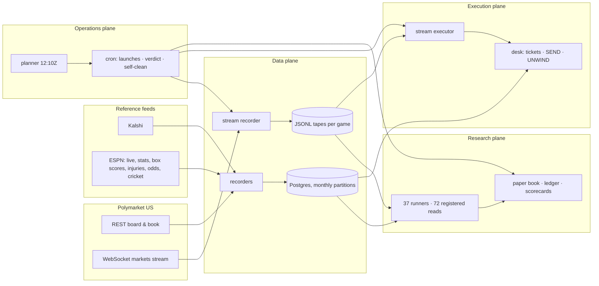

# Meridian

**A self-scheduling market-microstructure research and execution platform for
Polymarket US sports markets.**

Meridian records a regulated prediction-market venue at update resolution across
seven sports, tests every trading idea against pre-registered rules with
game-clustered statistics, and puts the one that survives — the venue's own
spread ladders contradicting themselves for seconds at a time — in front of a
trading desk that can send both legs in two clicks. It schedules, records,
grades and reports itself every night with no hands on it.

Built from a first commit on 2026-07-31 to ~139,000 lines of Python, 2,900+
tests and 180 documents in eight weeks, by one operator directing a team of AI
sessions held to the same rules as the code.

---

## What it does

| | |
|---|---|
| **Records** | Polymarket US winner, spread and total markets for NFL, college football, MLB, WNBA, cricket and table tennis — best bid/ask, size, fee coefficient, live state and score on every sweep; a 200 ms in-play feed; full order-book depth; and the venue's public WebSocket, taped per game with every book push and every print. Reference feeds: Kalshi boards and events, ESPN scoreboards, play-by-play, box scores, injuries, sportsbook odds, cricket toss and innings state. |
| **Researches** | 37 runners and 72 registered reads over one partitioned Postgres — point-in-time by construction, every estimate game-clustered with a sandwich interval, every number printed with its population and count. A nightly paper book settles 34 strategy lines against the venue's own results. |
| **Trades** | The ladder arbitrage: a spread ladder must be monotone in the line, and when the venue quotes it otherwise the desk tickets a two-leg pair that pays ≥ $1 in every state of the world. A stream executor tickets at the venue's clock; a FastAPI desk previews the ticket in the venue's own screen wording and sends both legs, stale side first, with a per-pair cap, a lock, and a fill watcher reconciling the venue's replies. |
| **Runs itself** | A planner reads the board daily and writes the night's cron: recorders per kickoff window, executors per game, a verdict after the last game, a self-clean the next morning. The verdict appends the edge ledger, replays every large crossing against the prints to call it real or phantom, checks the fee constant against the recorded column, computes settlement P&L per ticket and pushes four lines to a phone. |

---

## Architecture


```mermaid
flowchart LR
  subgraph venue["Polymarket US"]
    REST[REST board & book]
    WS[WebSocket markets stream]
  end
  subgraph ref["Reference feeds"]
    K[Kalshi]
    E[ESPN: live, stats, box scores, injuries, odds, cricket]
  end
  subgraph data["Data plane"]
    R[recorders] --> PG[(Postgres, monthly partitions)]
    S[stream recorder] --> T[(JSONL tapes per game)]
  end
  subgraph research["Research plane"]
    RR[37 runners · 72 registered reads] --> PB[paper book · ledger · scorecards]
  end
  subgraph exec["Execution plane"]
    X[stream executor] --> D[desk: tickets · SEND · UNWIND]
  end
  subgraph ops["Operations plane"]
    P[planner 12:10Z] --> C[cron: launches · verdict · self-clean]
  end
  REST --> R
  WS --> S
  K --> R
  E --> R
  PG --> RR
  T --> RR
  T --> X
  PG --> D
  C --> S
  C --> X
  C --> PB
```

**Data plane.** Seventeen feed modules write into one Postgres partitioned by
month (a query prunes only from a month-boundary floor — tested). Roughly
2.5 million venue snapshot rows a day, 87 million on disk, 16 million Kalshi
rows, 8.7 million depth rows, 12 GB of stream tapes.

**Research plane.** A box score is visible three hours after its own tip; a
quote at T−1h is the last one at or before it; a fee is the coefficient the
venue recorded on that row. Eighteen rungs on one game are one opinion, so
intervals cluster by game. The nightly scan, paper book, edge ledger, phantom
check, fee-drift line and two model scorecards run from cron and append to
files the dashboard reads.

**Execution plane.** The desk (`/arb`) shows a live ladder per game, the
executor's tickets, a two-click SEND that spells every term in the venue's
words — the row ("KC to win by over 6.5 points") and the button — and sends
immediate-or-cancel legs, leg 2 only for what leg 1 filled. A lock file the
executors honour, a per-pair cap, an order token held in session storage, and
an UNWIND.

**Operations plane.** `scripts/schedule_slate.py` plans; versioned launchers
under `scripts/launchers/` start containers; `slate_verdict.sh` grades every
tape exactly once, dated by its tag.

---

## The ladder arbitrage

For one team in one game the venue lists spread lines ℓ₁ < ℓ₂ < … Covering a
harder line implies covering every easier one, so YES prices must be monotone:
`YES(ℓ_hi) ≥ YES(ℓ_lo)`. A violation is a **bid** on a harder line above the
**ask** on an easier one by more than both taker fees,

```
E = B_lo − A_hi − f(A_hi) − f(B_lo),     f(p) = θ · p · (1 − p)
```

Buy the easier line at `A_hi`, sell the harder one at `B_lo` (on this venue,
buy its NO at `1 − B_lo`). The pair costs `1 − (B_lo − A_hi)` per contract and
pays $1 at settlement in every margin region — $2 if the margin lands between
the lines. The edge is an identity, not a forecast.

The venue breaks its ladders in play, at score changes, when rungs are re-quoted
one at a time and a stale resting order survives beside its moved neighbours
for a few hundred milliseconds to a few seconds. Measuring that honestly took
three instruments:

- a **stream recorder** on the venue's WebSocket (a REST sampler ran 54–62 s
  behind the venue and was retracted, at the table, with the figures it had
  produced);
- a **freshness gate** — a crossing counts only if the venue pushed both legs
  within two seconds of each other;
- a **phantom check** — each large crossing is replayed against the tape's
  prints; a taker lift above the displayed ask or a hit below the displayed
  bid during the crossing means the quote was a picture.

The **edge ledger** accrues one row per league per night: crossings, the
≥ $25-at-full-size statistic, and what a $20 attempt could have ticketed, with
their lives in seconds.

---

## The discipline

- **Pre-registration.** Estimator, decision rule, sample size and kill
  condition are written before the tape exists (`docs/math/*preregistration*`).
- **Named estimators.** Fills-weighted and equal-weight game means are both
  printed; "game-clustered" names the interval, not the estimate.
- **Fee per row.** The venue's coefficient is a constant of a period (it moved
  from 0.06 to 0.0695 on 2026-09-17). `core/fees.py` owns the constants;
  `recorded_fee(price, coefficient)` charges a historical row its own value
  and refuses `None`; two guard tests parse the tree for any restated fee and
  for any historical read that charges today's; `scripts/fee_drift.py`
  compares the constant to the column every night.
- **Guards at collection.** Sweep tests fail the suite on a defect's family —
  a restated threshold, a fee literal, a launcher's naming, a documented
  nightly read no cron script runs.
- **The ledger of being wrong.** [`docs/findings.md`](docs/findings.md): 41
  venue facts, 17 bugs, 20 corrections, each dated with what it cost and what
  would have caught it. Retractions sit at the table they retract.

---

## Repository layout

```
core/            feeds, ladder (scan · stream · executor · desk), pulse, quote, backtest, fees
cfb/             research runners (run_*.py) and the stream slate/executor entry points
scripts/         scheduler, launchers, edge ledger, fee drift, nightly scripts
static/          the dashboard (ARB desk, tape, log, P&L, scoreboard)
strategies/      registered paper-book strategy lines
alembic/         45 migrations
tests/           172 files, 2,900+ tests
STATUS.md        the running record, 90+ dated sections
docs/            findings.md, math/ (111 documents), ops/, infra/
```

---

## Running it

```bash
cp .env.example .env            # database URL, venue credentials, notification topic
docker compose up --build       # postgres, recorders, scheduler, api (dashboard on :8008), alerter
docker compose -f docker-compose.yml -f docker-compose.nfl.yml up -d      # per-sport overlays
.venv/bin/alembic upgrade head
.venv/bin/python -m pytest -q   # the suite needs a local Postgres on :5433
```

Production is one AWS host: the base compose plus the sport overlays, a daily
planner at 12:10Z that installs the night's launches, and the nightly scan at
04:40Z. Deploys are path-level checkouts of `origin/main` plus an api image
rebuild; `cfb/` and `scripts/` are bind-mounted into launched containers.

---

## Documents

- [`STATUS.md`](STATUS.md) — the running record, newest sections last; start at §0cd.
- [`docs/findings.md`](docs/findings.md) — what the venue actually does, what broke, what we retracted.
- [`docs/math/`](docs/math/) — one short document per question: the fee, the ladder fill test, the stream instrument, cricket in play, the WNBA player model, the PULSE live scorecard, and 100 more.
- [`docs/how-it-all-works.md`](docs/how-it-all-works.md) — the project in plain language.
- [`docs/ops/intern-desk-guide.md`](docs/ops/intern-desk-guide.md) — a one-page guide to the desk for a new trader.
