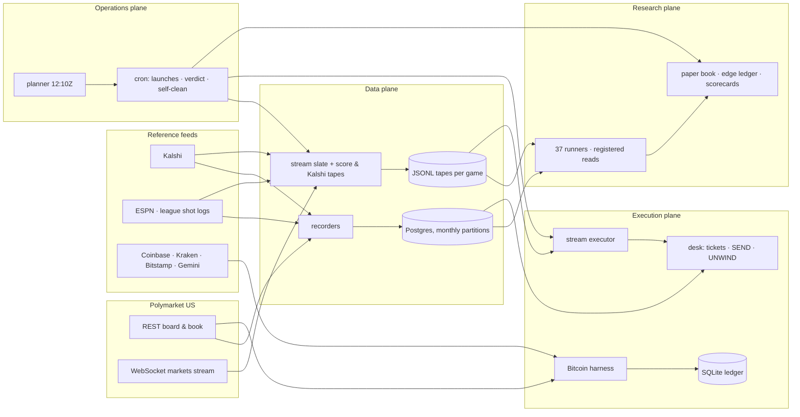

# Meridian

**A self-scheduling market-microstructure research and execution platform for
prediction markets.**

Meridian records Polymarket US at update resolution — sports and crypto — with
Kalshi and the leagues' own feeds beside it, tests every trading idea against
rules written before the data, and turns what survives into execution: a desk
for the venue's spread ladders when they contradict themselves, and an
autonomous model-driven harness on the Bitcoin Up-or-Down markets. It is
market-agnostic by design: the instruments, the statistics and the guards are
the same whether the contract settles on a touchdown, a wicket or a Bitcoin
index. It schedules, records, grades and reports itself every day with no
hands on it.

Built from a first commit on 2026-07-31 to ~142,000 lines of Python, 3,000+
tests and 180+ documents in two months, by one operator directing a team of AI
sessions held to the same rules as the code.

---

## What it does

| | |
|---|---|
| **Records** | Polymarket US winner, spread and total markets for NFL, college football, MLB, WNBA, cricket, table tennis and eight international basketball leagues (EuroLeague, Mexico's LNBP, Germany's BBL, VTB, Turkey's BSL, Denmark, Slovenia, Hungary), and the 15-minute and hourly Bitcoin markets: best bid/ask, size, fee coefficient, live state and score on every sweep; a 200 ms in-play feed; full order-book depth; and the venue's public WebSocket, taped per game with every book push and every print. Beside it: Kalshi boards and events, ESPN scoreboards, play-by-play, box scores, injuries, sportsbook odds, cricket state, a four-exchange Bitcoin composite at 1 Hz, and league shot logs stamped to the second. |
| **Researches** | 37 runners and 60 reads whose rules were fixed before their data, over one partitioned Postgres — point-in-time by construction, every estimate clustered by game with a sandwich interval, every number printed with its population and count. A nightly paper book settles 34 strategy lines against the venue's own results. |
| **Trades** | The **ladder arbitrage**: a spread ladder must be monotone in the line, and when the venue quotes it otherwise the desk tickets a two-leg pair that pays ≥ $1 in every state of the world. A stream executor tickets at the venue's clock; the desk previews each ticket in the venue's own screen wording and sends both legs, stale side first, under a per-pair cap, a lock and a fill watcher. |
| **Decides** | The **Bitcoin harness**: every window an OpenAI model states the probability that Bitcoin settles above the price to beat; the harness buys one contract of the side it favours, settles it off the venue's result, and feeds the model its own record and the lessons it wrote. Integer-cent ledger, a $10 drawdown limit enforced from the rows, dollar-capped model spend, and an automatic pause for a model that forecasts worse than the market. |
| **Runs itself** | A planner reads the board daily and writes the day's schedule: recorders per kickoff window, executors per game, a verdict after the last game, a self-clean the next morning. The verdict appends the edge ledger, replays every large crossing against the prints to call it real or phantom, checks the fee constant against the recorded column, computes settlement P&L per ticket and pushes four lines to a phone. |

---

## Architecture


```mermaid
flowchart LR
  subgraph venue["Polymarket US"]
    REST[REST board & book]
    WS[WebSocket markets stream]
  end
  subgraph ref["Reference feeds"]
    K[Kalshi]
    E[ESPN · league shot logs]
    X[Coinbase · Kraken · Bitstamp · Gemini]
  end
  subgraph data["Data plane"]
    R[recorders] --> PG[(Postgres, monthly partitions)]
    S[stream slate + score & Kalshi tapes] --> T[(JSONL tapes per game)]
  end
  subgraph research["Research plane"]
    RR[37 runners · registered reads] --> PB[paper book · edge ledger · scorecards]
  end
  subgraph exec["Execution plane"]
    SX[stream executor] --> D[desk: tickets · SEND · UNWIND]
    B[Bitcoin harness] --> L[(SQLite ledger)]
  end
  subgraph ops["Operations plane"]
    P[planner 12:10Z] --> C[cron: launches · verdict · self-clean]
  end
  REST --> R
  WS --> S
  K --> R
  K --> S
  E --> R
  E --> S
  X --> B
  REST --> B
  PG --> RR
  T --> RR
  T --> SX
  PG --> D
  C --> S
  C --> SX
  C --> PB
```

**Data plane.** Seventeen feed modules write into one Postgres partitioned by
month (a query prunes only from a month-boundary floor — tested): 94 million
venue snapshot rows, 139 million depth rows, 17 million Kalshi rows. The
WebSocket stream writes per-game tapes — 22 GB so far — and in the thin
basketball leagues each tape carries the venue's own score with its timestamp,
Kalshi's touch on the same game, and, for EuroLeague, the league's shot log
with the second of every basket.

**Research plane.** A box score is visible three hours after its own tip; a
quote at T−1h is the last one at or before it; a fee is the coefficient the
venue recorded on that row. Eighteen rungs on one game are one opinion, so
intervals cluster by game. The nightly scan, paper book, edge ledger, phantom
check, fee-drift line and model scorecards run from cron and append to files
the dashboard reads.

**Execution plane.** The dashboard's ARB tab shows a live ladder per game, the
executor's tickets, and a two-click SEND that spells every term in the venue's
words — the row ("KC to win by over 6.5 points") and the button — and sends
immediate-or-cancel legs, leg 2 only for what leg 1 filled. The BTC tab shows
each window's call beside the market's and a random walk's, the model's
reasoning, the fill, the price against the line, the allocation's record, and
the lessons the model reads before its next call.

**Operations plane.** `scripts/schedule_slate.py` plans; versioned launchers
under `scripts/launchers/` start containers; `slate_verdict.sh` grades every
tape exactly once, dated by its tag.

---

## The ladder arbitrage

For one team in one game the venue lists spread lines ℓ₁ < ℓ₂ < … Covering a
harder line implies covering every easier one, so YES prices must be monotone:
`YES(ℓ_hi) ≥ YES(ℓ_lo)`. A violation is a **bid** on a harder line above the
**ask** on an easier one by more than both taker fees,

```
E = B_lo − A_hi − f(A_hi) − f(B_lo),     f(p) = θ · p · (1 − p)
```

Buy the easier line at `A_hi`, sell the harder one at `B_lo` (on this venue,
buy its NO at `1 − B_lo`). The pair costs `1 − (B_lo − A_hi)` per contract and
pays $1 at settlement in every margin region — $2 if the margin lands between
the lines. The edge is an identity, not a forecast.

The venue breaks its ladders in play, at score changes, when rungs are re-quoted
one at a time and a stale resting order survives beside its moved neighbours
for a few hundred milliseconds to a few seconds. Measuring that honestly took
three instruments:

- a **stream recorder** on the venue's WebSocket (a REST sampler ran 54–62 s
  behind the venue and was retracted, at the table, with the figures it had
  produced);
- a **freshness gate** — a crossing counts only if the venue pushed both legs
  within two seconds of each other;
- a **phantom check** — each large crossing is replayed against the tape's
  prints; a taker lift above the displayed ask or a hit below the displayed
  bid during the crossing means the quote was a picture.

The **edge ledger** accrues one row per league per night: crossings, the
≥ $25-at-full-size statistic, and what a $20 attempt could have ticketed, with
their lives in seconds.

---

## The Bitcoin harness

Polymarket US lists "Bitcoin Up or Down" every 15 minutes and every hour: Up pays
$1 if the 60-second average of CF Benchmarks' BRTI before the window closes is at
least the same average before it opened. The harness is built so that the model
is the only moving part:

- **Features, point-in-time.** About sixty, each named with its unit: distance to
  the line in dollars, basis points and volatility units over the time left;
  returns from 10 s to 24 h; realized volatility; momentum and trend on three
  timeframes; the venue's book and Kalshi's same-window price; funding; the run
  of recent results. Two baselines ride with every window: the market's mid and a
  driftless random walk to the settlement average,
  `P(up) = Φ(ln(S/K) / (σ·√(τ − 40 s)))`.
- **One decision, deterministic execution.** The model returns `p_up` under a
  strict schema; the harness buys one contract of the favoured side at the ask.
  The model never sizes, times or cancels.
- **Learning from its own record.** Each call carries the model's hit rate, its
  Brier score against the market's and the random walk's on the same windows,
  its P&L and drawdown, its last twenty calls with outcomes, and the last twelve
  lessons it wrote after each settlement.
- **A ledger that cannot overspend.** Money in integer units of $0.0001; the
  database refuses a second contract, a second fill per window and a second
  settlement; before every fill the guard assumes every open position and this
  one lose in full and allows the trade only within $10 of the high-water mark,
  latching off when the next trade alone could breach it. A randomized test
  checks the invariant across 3,000 trades.
- **Bounded cost.** Every call's tokens are priced at the model's listed rates
  and stored by day; at the daily dollar cap the window is recorded and nothing
  is asked. After 200 scored windows, a model whose Brier score is worse than the
  market's own price is paused.

---

## Thin markets

International basketball on the venue is a single winner market per game, books
7¢ wide and often empty, while Kalshi trades the same fixtures in six figures.
The working thesis is that in markets this quiet the edge is information and
speed. Every thin-league game is taped from three hours before tip with the
venue's own score changes, Kalshi's price, and the league's clock; the first
read — does the venue reprice late after its own score changes? — has its
estimator, control and kill conditions written before the first tape
([`docs/math/thin-league-speed-preregistration.md`](docs/math/thin-league-speed-preregistration.md)).

---

## The discipline

- **Pre-registration.** Estimator, decision rule, sample size and kill
  condition are written before the tape exists (`docs/math/*preregistration*`).
- **Named estimators.** Fills-weighted and equal-weight game means are both
  printed; "game-clustered" names the interval, not the estimate.
- **Fee per row.** The venue's coefficient is a constant of a period (it moved
  from 0.06 to 0.0695 on 2026-09-17). `core/fees.py` owns the constants;
  `recorded_fee(price, coefficient)` charges a historical row its own value
  and refuses `None`; two guard tests parse the tree for any restated fee and
  for any historical read that charges today's; `scripts/fee_drift.py`
  compares the constant to the column every night.
- **Guards at collection.** Sweep tests fail the suite on a defect's family —
  a restated threshold, a fee literal, a launcher's naming, a documented
  nightly read no cron script runs, a page that fetches a route that does not
  exist.
- **The ledger of being wrong.** [`docs/findings.md`](docs/findings.md): venue
  facts, bugs and corrections, each dated with what it cost and what would have
  caught it. Retractions sit at the table they retract.

---

## Repository layout

```
core/            feeds, ladder (scan · stream · executor · desk · score & Kalshi tapes), btc15, kalshi, pulse, quote, backtest, fees
cfb/             research runners (run_*.py) and the stream slate/executor entry points
scripts/         scheduler, launchers, edge ledger, fee drift, nightly scripts
static/          the dashboard (ARB desk, BTC, tape, log, P&L, scoreboard)
strategies/      registered paper-book strategy lines
alembic/         45 migrations
tests/           176 files, 3,000+ tests
STATUS.md        the running record, 90+ dated sections
docs/            findings.md, math/ (116 documents), ops/, infra/
```

---

## Running it

```bash
cp .env.example .env            # database URL, venue credentials, notification topic
docker compose up --build       # postgres, recorders, scheduler, api (dashboard on :8008), alerter
docker compose -f docker-compose.yml -f docker-compose.nfl.yml up -d      # per-sport overlays
docker compose -f docker-compose.yml -f docker-compose.btc15.yml up -d    # the Bitcoin harness
.venv/bin/alembic upgrade head
.venv/bin/python -m pytest -q   # the suite needs a local Postgres on :5433
```

Production is one AWS host: the base compose plus the overlays, a daily planner
at 12:10Z that installs the day's launches, and the nightly scan at 04:40Z.
Deploys are path-level checkouts of `origin/main` plus an api image rebuild;
`core/`, `cfb/` and `scripts/` are bind-mounted into launched containers.

---

## Documents

- [`STATUS.md`](STATUS.md) — the running record, newest sections last; §0cj (the Bitcoin harness) and §0ck (thin leagues) are the latest.
- [`docs/findings.md`](docs/findings.md) — what the venue actually does, what broke, what we retracted.
- [`docs/math/`](docs/math/) — one short document per question: the fee, the ladder fill test, the stream instrument, [the Bitcoin harness](docs/math/btc15-harness.md), [thin-league live feeds](docs/math/thin-league-live-feeds.md), cricket in play, and a hundred more.
- [`docs/ops/intern-desk-guide.md`](docs/ops/intern-desk-guide.md) — a one-page guide to the desk for a new trader.
- [`docs/README.md`](docs/README.md) — the document index, with the first phase (a WNBA fair-value model, August 2026) kept as history.
