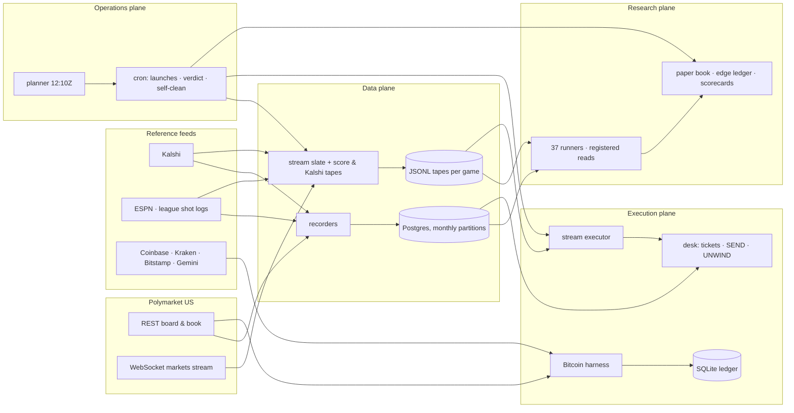

# Meridian

**A quantitative research and trading platform for prediction markets.**

Meridian captures Polymarket US at update resolution — sports and crypto — beside
Kalshi and the leagues' own feeds, holds every trading idea to pre-registered,
cluster-robust inference, and puts what survives into execution: an arbitrage
engine for no-arbitrage violations in the venue's spread ladders, and an
autonomous model-driven harness on the 15-minute and hourly Bitcoin markets. The
method is market-agnostic — the same instruments, statistics and risk controls
apply whether a contract settles on a touchdown, a wicket or a Bitcoin index —
and the whole system schedules, records, grades and reports itself every day.

Built from a first commit on 2026-07-31 to ~142,000 lines of Python, 3,000+
tests and 180+ documents in two months, by one operator directing a team of AI
coding agents held to the same rules as the code.

---

## Quantitative research

- **No-arbitrage in strike ladders.** A spread ladder must be monotone in the
  line; a violation net of both taker fees is a two-leg pair that pays at least
  $1 in every outcome. Measured on the venue's WebSocket at update resolution
  ([below](#the-ladder-arbitrage)).
- **Validate the instrument before the inference.** REST snapshots against the
  venue's stream on 39,510 rung observations: REST lagged by more than 1 s on
  37,455 and led on 1, and only 239 of 7,972 REST-reported crossings (3.0 %)
  existed on the stream. The REST figures were retracted at the table that
  printed them; a 2-s two-leg freshness gate and a trade-replay phantom check
  replaced them (8 of 29 large stream crossings traded through the displayed
  quote).
- **Inference on dependent data.** Sandwich intervals clustered by game with
  the G/(G−1) correction and slate-level clustering printed beside; power stated
  before the data; the estimator named in every label — fills-weighted and
  equal-weight game means once differed by more than the interval (−2.08¢ vs
  −3.35¢).
- **Pre-registration with falsifiable controls.** 60 reads whose estimator,
  gate and kill conditions were fixed before the tape (`docs/math/*preregistration*`),
  each with a control that must be able to fail — a random-instant mark-out
  that must come out negative, a permutation that must destroy the effect and
  nothing else.
- **Forecast evaluation.** Brier scoring against the market mid and a driftless
  random walk. The venue's price beat a lineup-aware WNBA model over 106 games
  and an in-game model's live decisions over 52 (Brier difference −0.0012, 95 %
  CI [−0.0115, +0.0091]) — so the search moved from out-forecasting the price
  to microstructure and latency.
- **Costs and leakage as data.** The quadratic taker fee θ·p·(1−p) is a
  constant of a period (θ rose 0.06 → 0.0695 on 2026-09-17): `core/fees.py`
  charges each historical row the coefficient it recorded, and two AST guard
  tests fail the suite on a restated fee or a row charged today's. Adverse
  selection measured at −2.66¢ per filled quote kept a market-making strategy
  unbuilt; a +3.58¢ maker "edge" was traced to a one-minute look-ahead and
  retracted.
- **Point-in-time by construction.** A box score is visible three hours after
  its own tip; a quote at T−1h is the last one at or before it. The ledger of
  being wrong — [`docs/findings.md`](docs/findings.md) — dates every venue fact,
  bug and retraction with what it cost and what would have caught it.

## Quantitative development

- **Market-data capture.** A WebSocket recorder subscribes whole slates (≤ 100
  markets per subscription) and writes per-game tapes of every book update and
  print with venue and receive timestamps (22 GB). Beside it: a 200 ms in-play
  feed and REST sweeps with full depth into monthly-partitioned PostgreSQL —
  94 million snapshot rows, 139 million depth rows, 17 million Kalshi rows —
  where partition pruning was verified to need month-boundary predicates.
- **Execution.** Two-leg immediate-or-cancel limit orders, stale leg first, the
  second leg sized to the first leg's fill; per-pair caps, a kill-switch lock
  honoured by executors and server, an order token, a fill watcher reconciling
  the venue's replies, and an unwind path. Tickets are previewed in the venue's
  own screen wording.
- **Scheduling under a rate limit.** `scripts/schedule_slate.py` reads the board
  daily and writes the day's cron: stream recorders per kickoff window,
  executors per game inside a shared 20 req/s REST budget (REST executors capped
  per 90-minute bucket), a verdict that grades every tape once, a self-clean.
- **Autonomous trading harness.** A 1 Hz median-of-four-exchanges Bitcoin
  composite, ~60 point-in-time features, strict-schema model forecasts, and an
  integer-unit SQLite ledger with CHECK and UNIQUE constraints; a latching
  drawdown guard verified by a 3,000-trade randomized invariant test; every
  model call costed from its reported tokens (cache writes included) against a
  daily dollar cap ([below](#the-bitcoin-harness)).
- **Reliability on one host.** Repeated PostgreSQL OOM kills on a 7.6 GB box
  traced to an IN-subquery that hashed a 90M-row table, fixed with chunked key
  lookups; monitors that alarm on what is missing, not only on what arrives,
  after a venue froze its prices while its timestamps kept advancing.
- **Testing and deployment.** 3,000+ pytest tests, including AST sweeps that
  fail the suite on a whole defect family and a smoke test of every route and of
  every URL a page fetches; Docker Compose on AWS; a FastAPI dashboard; read-only
  SQLite mounts across containers; path-level deploys from `origin/main`.

---

## Architecture


```mermaid
flowchart LR
  subgraph venue["Polymarket US"]
    REST[REST board & book]
    WS[WebSocket markets stream]
  end
  subgraph ref["Reference feeds"]
    K[Kalshi]
    E[ESPN · league shot logs]
    X[Coinbase · Kraken · Bitstamp · Gemini]
  end
  subgraph data["Data plane"]
    R[recorders] --> PG[(Postgres, monthly partitions)]
    S[stream slate + score & Kalshi tapes] --> T[(JSONL tapes per game)]
  end
  subgraph research["Research plane"]
    RR[37 runners · registered reads] --> PB[paper book · edge ledger · scorecards]
  end
  subgraph exec["Execution plane"]
    SX[stream executor] --> D[desk: tickets · SEND · UNWIND]
    B[Bitcoin harness] --> L[(SQLite ledger)]
  end
  subgraph ops["Operations plane"]
    P[planner 12:10Z] --> C[cron: launches · verdict · self-clean]
  end
  REST --> R
  WS --> S
  K --> R
  K --> S
  E --> R
  E --> S
  X --> B
  REST --> B
  PG --> RR
  T --> RR
  T --> SX
  PG --> D
  C --> S
  C --> SX
  C --> PB
```

---

## The ladder arbitrage

For one team in one game the venue lists spread lines ℓ₁ < ℓ₂ < … Covering a
harder line implies covering every easier one, so YES prices must be monotone:
`YES(ℓ_hi) ≥ YES(ℓ_lo)`. A violation is a **bid** on a harder line above the
**ask** on an easier one by more than both taker fees,

```
E = B_lo − A_hi − f(A_hi) − f(B_lo),     f(p) = θ · p · (1 − p)
```

Buy the easier line at `A_hi`, sell the harder one at `B_lo` (on this venue,
buy its NO at `1 − B_lo`). The pair costs `1 − (B_lo − A_hi)` per contract and
pays $1 at settlement in every margin region — $2 if the margin lands between
the lines. The edge is an identity, not a forecast.

Violations appear in play: after a score the venue re-quotes rungs one at a
time, and a stale resting order survives beside its re-priced neighbours for a
fraction of a second to a few seconds. The engine (`core/ladder/`) keeps a
last-known touch per rung from the stream, checks only the pairs touching the
rung that moved, opens an episode only when both legs were pushed within 2 s of
each other, and replays each large episode against the prints. A nightly edge
ledger records, per league, the count, the size at the touch and the lifetime in
seconds, net of the fee each row carried.

---

## The Bitcoin harness

Polymarket US lists "Bitcoin Up or Down" every 15 minutes and every hour: Up pays
$1 if the 60-second average of CF Benchmarks' BRTI before the window closes is at
least the same average before it opened. The harness is built so that the model
is the only moving part:

- **Features, point-in-time.** About sixty, each named with its unit: distance to
  the line in dollars, basis points and volatility units over the time left;
  returns from 10 s to 24 h; realized volatility; momentum and trend on three
  timeframes; the venue's book and Kalshi's same-window price; funding; the run
  of recent results. Two baselines ride with every window: the market's mid and a
  driftless random walk to the settlement average,
  `P(up) = Φ(ln(S/K) / (σ·√(τ − 40 s)))` — the average over the final 60 s
  carries only a third of that minute's variance (20 s of 60), hence the 40 s.
- **One decision, deterministic execution.** The model returns `p_up` under a
  strict schema; the harness buys one contract of the favoured side at the ask.
  The model never sizes, times or cancels.
- **Learning from its own record.** Each call carries the model's hit rate, its
  Brier score against the market's and the random walk's on the same windows,
  its P&L and drawdown, its last twenty calls with outcomes, and the last twelve
  lessons it wrote after each settlement.
- **A ledger that cannot overspend.** Money in integer units of $0.0001; the
  database refuses a second contract, a second fill per window and a second
  settlement; before every fill the guard assumes every open position and this
  one lose in full and allows the trade only within $10 of the high-water mark,
  latching off when the next trade alone could breach it. A randomized test
  checks the invariant across 3,000 trades.
- **Bounded cost.** Every call's tokens are priced at the model's listed rates
  and stored by day; at the daily dollar cap the window is recorded and nothing
  is asked. After 200 scored windows, a model whose Brier score is worse than the
  market's own price is paused.

---

## Thin markets

In illiquid markets the edge is information and latency. International
basketball on the venue is one winner market per game, books around 7¢ wide and
often empty, while Kalshi trades the same fixtures in six figures. Every game in
eight leagues is taped from three hours before tip against three clocks: the
venue's own score changes (its `updatedAt` stamp, each change bracketed by the
poll before), Kalshi's touch, and for EuroLeague the league's shot log stamped
to the second — matched to the venue's game by a hand-built club table, the start
minute and home = local. The registered test buys the scoring side at the ask
visible 1 s after the venue's score changes and marks out at 60 s net of fee,
game-clustered; its random-instant control must lose money or the test is void,
and it is killed if 90 % of events are already repriced by the time an order
could land ([`docs/math/thin-league-speed-preregistration.md`](docs/math/thin-league-speed-preregistration.md)).

---

## Repository layout

```
core/            feeds, ladder (scan · stream · executor · desk · score & Kalshi tapes), btc15, kalshi, pulse, quote, backtest, fees
cfb/             research runners (run_*.py) and the stream slate/executor entry points
scripts/         scheduler, launchers, edge ledger, fee drift, nightly scripts
static/          the dashboard (ARB desk, BTC, tape, log, P&L, scoreboard)
strategies/      registered paper-book strategy lines
alembic/         45 migrations
tests/           176 files, 3,000+ tests
STATUS.md        the running record, 90+ dated sections
docs/            findings.md, math/ (116 documents), ops/, infra/
```

---

## Running it

```bash
cp .env.example .env            # database URL, venue credentials, notification topic
docker compose up --build       # postgres, recorders, scheduler, api (dashboard on :8008), alerter
docker compose -f docker-compose.yml -f docker-compose.nfl.yml up -d      # per-sport overlays
docker compose -f docker-compose.yml -f docker-compose.btc15.yml up -d    # the Bitcoin harness
.venv/bin/alembic upgrade head
.venv/bin/python -m pytest -q   # the suite needs a local Postgres on :5433
```

Production is one AWS host: the base compose plus the overlays, a daily planner
at 12:10Z that installs the day's launches, and the nightly scan at 04:40Z.
Deploys are path-level checkouts of `origin/main` plus an api image rebuild;
`core/`, `cfb/` and `scripts/` are bind-mounted into launched containers.

---

## Documents

- [`STATUS.md`](STATUS.md) — the running record, newest sections last; §0cj (the Bitcoin harness) and §0ck (thin leagues) are the latest.
- [`docs/findings.md`](docs/findings.md) — what the venue actually does, what broke, what we retracted.
- [`docs/math/`](docs/math/) — one short document per question: the fee, the ladder fill test, the stream instrument, [the Bitcoin harness](docs/math/btc15-harness.md), [thin-league live feeds](docs/math/thin-league-live-feeds.md), cricket in play, and a hundred more.
- [`docs/ops/intern-desk-guide.md`](docs/ops/intern-desk-guide.md) — a one-page guide to the desk for a new trader.
- [`docs/README.md`](docs/README.md) — the document index, with the first phase (a WNBA fair-value model, August 2026) kept as history.
