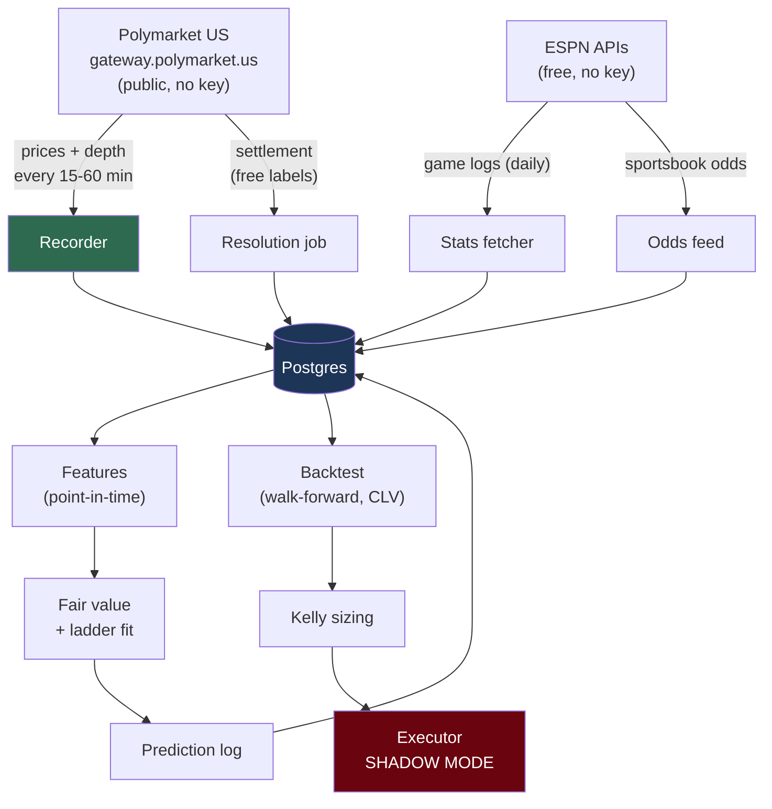
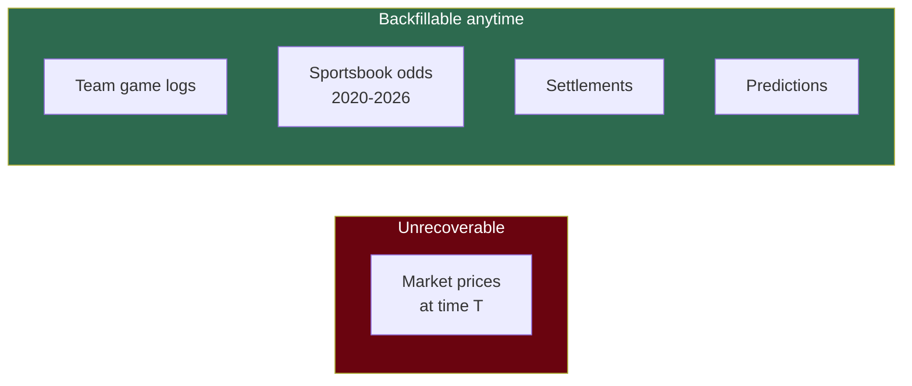
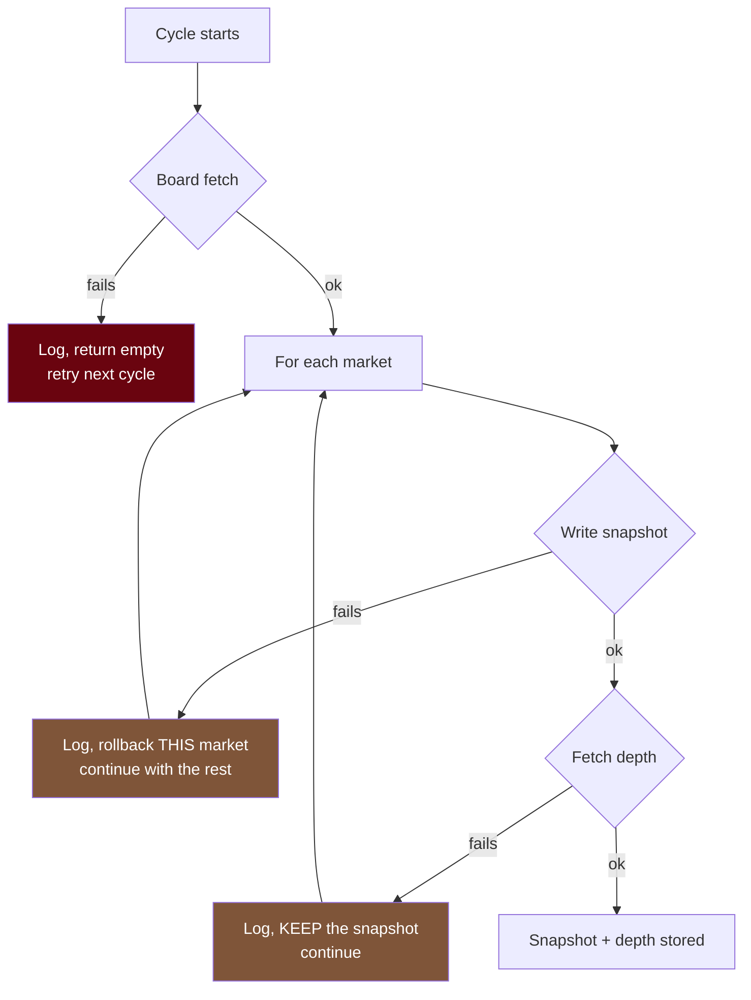

# Architecture

How the pieces fit together, and why the boundaries sit where they do.

## Data flow



The recorder is highlighted because it's the only irreplaceable component. The executor is highlighted because it's the only one that can lose money — and in v1 it places nothing.

## Repo layout

```
Meridian/
├── core/                     # shared across all sports
│   ├── recorder.py           # Polymarket snapshot poller
│   ├── config.py             # env-driven settings
│   ├── ratelimit.py          # token bucket
│   ├── config_hash.py        # deterministic model-config hashing
│   ├── polymarket/           # gateway client + schemas
│   └── storage/              # models, engine, session
├── strategies/
│   └── wnba_totals/          # WNBA-specific features + model
├── alembic/                  # migrations
├── tests/
└── docs/
```

**Why a monorepo with a shared core.** Data ingestion, risk sizing, and execution are identical regardless of sport. Adding MLB means adding `strategies/mlb_totals/` — a feature set and a fair-value model — with nothing in `core/` changing. Forking the whole system per sport would triple the maintenance of the parts that aren't sport-specific.

## The critical asymmetry



This drives the entire build order. Everything on the right can be reconstructed months later from free sources. The bid/ask at 7:42pm on a Tuesday exists only if something wrote it down at 7:42pm on that Tuesday.

**Predictions are on the right-hand side**, which is less obvious. A prediction is a deterministic function of (features `as_of` T, market price at T). Features are backfillable; market prices are recorded. So the whole prediction log can be regenerated retroactively over recorded snapshots — *provided the recorder was running*.

Hence: get the recorder up first, deploy it second, build the model at leisure.

## Failure isolation

The recorder catches errors at the narrowest scope that still allows progress:



The principle: **never lose the cycle for one bad row.** One malformed market must not cost the other 149. A recorder that dies unattended is worse than one that records 149/150 markets.

## Idempotency

```sql
UNIQUE (market_slug, captured_at)
```

Insert with `ON CONFLICT DO NOTHING`. Crash mid-cycle, rerun, and the same rows re-insert harmlessly. Correctness lives in the database constraint rather than in application bookkeeping that can drift.

All rows in a cycle share one `captured_at`, so a snapshot is a coherent instant rather than a smear across the fetch.

## Adaptive cadence

| Condition | Interval |
|---|---|
| Game live, or tip-off within 6h | **15 min** |
| Otherwise | **60 min** |
| Board unreachable | **15 min** (fail toward over-sampling) |

Line movement concentrates before tip-off. Polling hourly overnight wastes nothing of value. When we can't tell, we over-sample: extra requests are cheap, missed data is permanent.

## Design rules

1. **Limit orders only** — enforced by construction, no market-order code path exists
2. **No lookahead** — enforced by construction, immutable per-game rows and mandatory `as_of`
3. **Log every prediction, forever** — including non-actionable ones, as the control group
4. **Start simple** — complexity only when it beats the baseline out-of-sample
5. **Human in the loop** — shadow → confirm → autonomous, gated on a real track record
