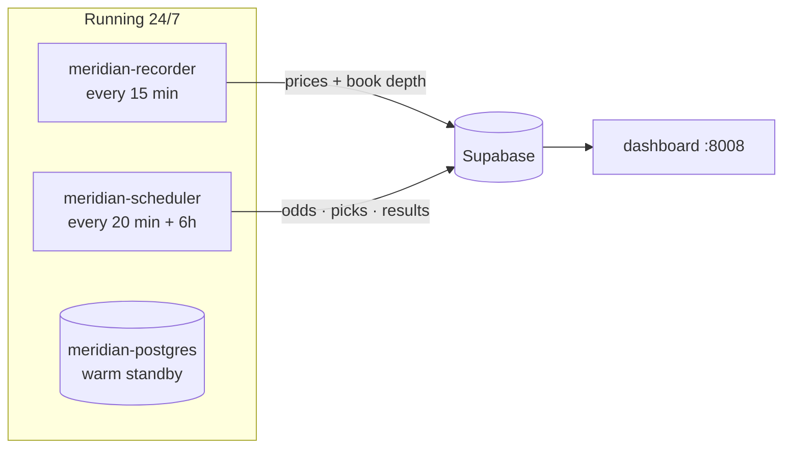

# What is actually running, and why it matters when nothing is happening

Three containers. That is the whole system.



## What each one does

**`meridian-recorder`** — every 15 minutes, asks Polymarket for the entire WNBA
board and writes down every price and the full order book. It does this whether
or not a game is on, because markets for future games exist days in advance.

**`meridian-scheduler`** — every 20 minutes it refreshes sportsbook lines, makes
predictions, and writes shadow orders. Every 6 hours it also pulls game logs,
box scores, and resolves finished games.

**`meridian-postgres`** — a local copy that used to be primary. Now it is a warm
standby and the fast source for backtests (remote round-trips are slow).

## The thing that is genuinely irreplaceable

Everything the system stores can be re-fetched later **except one thing**:

| Data | If we lose it |
|---|---|
| Game results, box scores, team stats | Re-fetch from ESPN any time. Free. |
| Sportsbook closing lines | Re-fetch from ESPN. Free. |
| Settlements | Re-fetch from Polymarket. Free. |
| Predictions | Regenerate — the model is deterministic. |
| **Polymarket prices at 3:47pm on a Tuesday** | **Gone. Forever. No one sells it.** |

That is the entire reason for "leave the machine on". Polymarket does not publish
price history for its US venue. If our recorder is not awake at 3:47pm, that
moment simply never existed as far as we are concerned — and the whole
cross-market strategy is built on comparing *our* price history against the
book's.

## But does anything happen overnight?

Measured on our own recorded data — how much a market's mid-price moves between
consecutive 15-minute cycles, in-game excluded:

| Window | Avg move | Cycles moving >1¢ |
|---|---|---|
| 24h+ before tipoff | 0.51¢ | 17% |
| 12–24h | 0.48¢ | 15% |
| **3–12h** | **1.02¢** | **31%** |
| 0–3h to tip | 0.20¢ | 9% |
| in-game | 8.26¢ | 82% |

And by clock hour (Eastern), the surprise: **4–5am ET shows the highest rate of
movement of any pregame hour (36% of cycles move >1¢)** — higher than the
afternoon. Overnight samples are small, so treat the exact number loosely, but
the direction is clear and it makes sense: the book is thinnest overnight, so a
single order moves it further. Those are precisely the dislocations a thin-venue
strategy cares about.

The other useful finding: **0–3h before tipoff is the quietest pregame window**
(0.20¢). By then the market has settled. The action is 3–12h out — which is when
lineup and injury news lands.

## So, practically

Leave it running. Not because "something might happen", but because the two
windows that matter most — 3–12h before tipoff, and the thin overnight hours —
are both *outside* the times you would intuitively think to keep it on.

Check for damage any time with:

```bash
python -m core --status
```

It reports gaps over 90 minutes explicitly. A gap is not an error to fix; it is
a hole in the dataset that cannot be filled.
