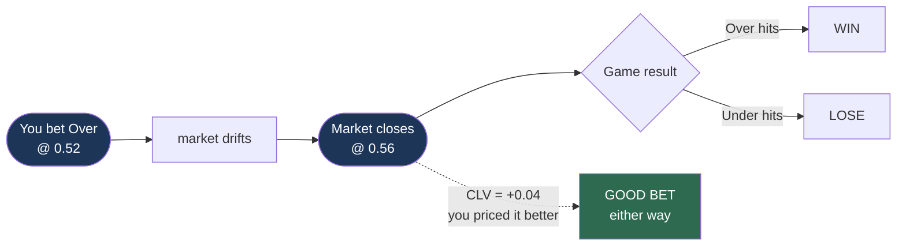

# Closing line value

**Question:** how do you tell whether a model has edge before the sample is large enough to prove it?

This is the primary metric. Win rate is secondary.

The point of the diagram: the branch on the right is noise, the dotted line is signal. A bet that beats the close and loses is still a good bet.

## The sample-size problem

Suppose the true edge is 55% win rate on even-money bets. After 40 bets, the standard error is

$$
\text{SE} = \sqrt{\frac{p(1-p)}{n}} = \sqrt{\frac{0.25}{40}} \approx 7.9\%
$$

So a 55% true edge produces observed win rates roughly in **47%–63%** one standard deviation out. A losing model and a winning model produce overlapping results.

**You cannot distinguish skill from luck at n=40 using win rate.** With a \$25–40 bankroll, n=40 is months of work.

## What CLV measures instead

The closing line is the market's final consensus, after all information arrives and the sharpest money has acted. It's the most accurate price the market ever produces.

CLV asks: **did you get a better price than the close?**

$$
\text{CLV} = p_{\text{close}} - p_{\text{entry}}
$$

in probability terms (positive = you got the better side).

Bet Over at 0.52; it closes at 0.56. You bought at 52¢ something the market later valued at 56¢. **+4% CLV** — regardless of whether the game went over.

## Why it converges faster

Win rate observes one bit per bet — did it win. CLV observes a **continuous** quantity on every bet, and it strips out the single largest noise source: the outcome itself.

A 55%-edge bet still loses 45% of the time. But if you consistently beat the close, you were consistently pricing better than the market, and outcome noise never enters.

Rough intuition: CLV reaches statistical significance in **tens** of bets where win rate needs **thousands**.

## The key discipline

**Track CLV even on losing bets.**

A bet that beat the close and lost is a *good bet with a bad outcome*. A bet that lost the close and won is a *bad bet that got lucky*. Judging by outcomes conflates the two, and that confusion is the most common way small-sample bettors fool themselves.

> If you beat the close consistently, profit follows given enough bets.
> If you don't, winning bets are luck and will revert.

## Coverage caveat — read this before trusting the number

CLV requires a genuine **closing** line. Our sources are uneven:

| Seasons | Available | CLV usable? |
|---|---|---|
| **2024–2026** | ESPN `open` + `close` totals | **Yes** |
| **2020–2023** | Consensus across 6–15 books, no open/close split | **No** |

The backtest must report what fraction of its sample has true closing lines, and **must never substitute a current line for a closing line**. Doing so fabricates the headline metric — the number would look fine and mean nothing.

## Limitations

- **CLV against which book?** Polymarket US closing prices and sportsbook closes can differ. Measure against both; state which.
- **Beating a bad close isn't edge.** Thin markets close inefficiently. On a WNBA book far thinner than the sportsbook consensus, beating Polymarket's close may reflect its illiquidity rather than skill. This is why we track both.
- **CLV doesn't measure profit.** You can beat the close and lose money to fees and spread. It measures *pricing* skill; [fees-and-spread.md](fees-and-spread.md) covers whether that skill survives costs.

## What we report

Not just mean CLV — the whole distribution:

- Mean CLV and its standard error
- % of bets beating the close
- CLV split by market type and edge bucket
- CLV on winners vs. losers separately (they should be similar; a large gap suggests outcome-driven selection)
