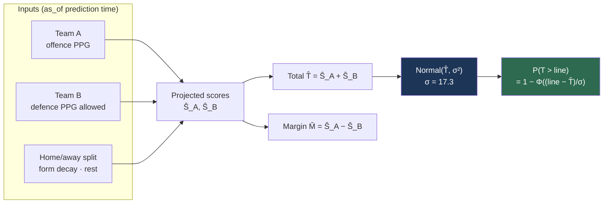

# Fair value projection

**Question:** given two teams, what total will this game produce, and what is the probability it goes over a given line?

The σ step is where a point estimate becomes a tradeable probability — and where most of the error lives.

## The projection

Each team's expected score blends its own offence with the opponent's defence:

$$
\hat{S}_A = \frac{\text{OffPPG}_A + \text{DefPPG allowed}_B}{2}
\qquad
\hat{S}_B = \frac{\text{OffPPG}_B + \text{DefPPG allowed}_A}{2}
$$

$$
\hat{T} = \hat{S}_A + \hat{S}_B
\qquad
\hat{M} = \hat{S}_A - \hat{S}_B
$$

$\hat{T}$ is the projected total, $\hat{M}$ the projected margin.

The simple average weights offence and defence equally. That's an assumption, not a result — a fitted weight is a candidate improvement, but only if it beats this baseline out-of-sample.

## From a point estimate to a probability

A projected total alone can't price a market. "Over 176.5" needs $P(T > 176.5)$, which requires a **distribution**, not just a mean.

Model the total as normal:

$$
T \sim \mathcal{N}(\hat{T}, \sigma^2)
\qquad
P(T > \ell) = 1 - \Phi\!\left(\frac{\ell - \hat{T}}{\sigma}\right)
$$

**Measured from 2023–2025 WNBA data (769 games): mean 164.0, σ = 17.3.**

σ does enormous work here. Since the model's edge comes from small differences between $\hat T$ and the market's implied mean, an error in σ maps almost directly into mispriced probability. It's computed from data and is the first thing to check when output looks wrong.

### Why normal is defensible

A game total is a sum of many roughly-independent scoring events, so the CLT does most of the justification. Real totals are mildly right-skewed (overtime has no symmetric counterpart), so the tails are imperfect. Near the middle of the ladder — where liquidity actually is — the approximation is good.

If it ever needs to be better, the fix is a fatter-tailed distribution (Student-t), not a more complex mean model.

## Inputs

All computed `as_of` the prediction time, from games strictly before it — see [point-in-time.md](point-in-time.md).

| Feature | Notes |
|---|---|
| Offence PPG | mean points scored |
| Defence PPG allowed | mean points conceded |
| Home/away split | both of the above, split by venue |
| Recent-form decay | exponentially weighted, half-life ~5 games |
| Rest days | days since previous game |
| Head-to-head | prior meetings this season |
| Record residual | see [pythagorean-record.md](pythagorean-record.md) |

### Recent-form decay

A game in July says more about tonight than a game in May, but old games still carry signal. So decay rather than truncate:

$$
w_i = 2^{-\Delta_i / h}
$$

with $\Delta_i$ the number of games back and $h$ the half-life. Truncating to "last 10 games" throws away real information and makes the estimate jumpier.

### Small-sample shrinkage

Early season, a team may have played three games. A three-game mean is noise, so shrink toward the league average:

$$
\tilde{x} = \frac{n \bar{x} + k \mu_{\text{league}}}{n + k}
$$

With few games you get roughly the league average; with many, roughly the team's own mean. $k \approx 5$. This is a Bayesian posterior mean under a normal prior — the standard treatment, and it degrades gracefully instead of producing absurd April projections.

## Why deliberately simple

A WNBA season is ~250–300 games league-wide. Complex models memorise datasets that small. This linear baseline is the thing every future model has to beat **out-of-sample** before its complexity is justified.

That's not modesty, it's the cheapest way to avoid fitting noise.

## Known limitations

- **Equal offence/defence weighting** is assumed, not fitted.
- **No pace adjustment.** Two teams that both play fast produce more possessions and a higher total than their PPG averages imply. This is the most likely first real improvement.
- **No injury awareness.** If a starter is out, season-average PPG is stale and the model cannot detect it. Deliberately deferred to a separate pregame check.
- **Normal tails** understate blowouts and overtime.
