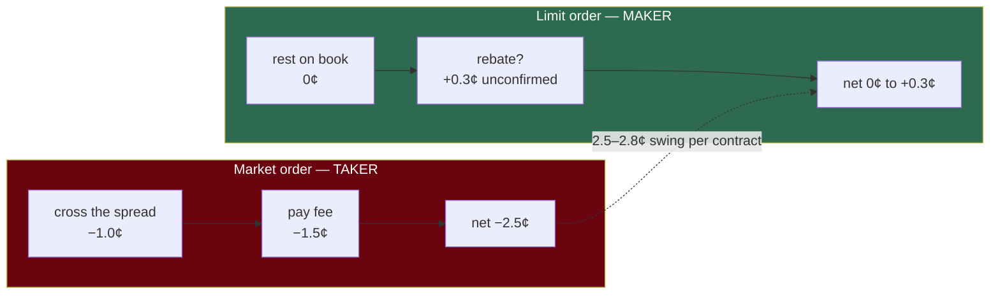

# Fees and spread — what a trade actually costs

**Question:** how much edge do you need before a trade is worth making?

This was missing from the original project brief, and it's large enough to change conclusions.

At $p=0.50$, per contract. That swing is comparable to the entire edge being hunted — which is why the executor has no market-order code path at all.

## The fee formula

$$
\text{fee} = \Theta \cdot C \cdot p \cdot (1 - p)
$$

$C$ = contracts, $p$ = price, $\Theta$ = the coefficient:

| Role | $\Theta$ | Per 100 contracts at $p=0.50$ | Confidence |
|---|---|---|---|
| **Taker** (crosses the spread) | $+0.06$ | pays **\$1.50** | **measured — venue-published** |
| **Maker** (rests on the book) | $0$ (default) | pays **\$0** | rebate never observed; $-0.0125$ survives only as an explicit sensitivity arm |

### The taker coefficient is confirmed (2026-08-04)

`market_snapshots.fee_coefficient` is published by the venue on every market and
reads **0.060000 across 874,267 rows and all 241 markets** — totals, spreads and
winners alike. Third-party summaries claiming a sports-specific $\Theta$ of 0.05
are wrong for this board. This one is not an assumption any more.

### The maker rebate is not confirmed, and the headline ROI depends on it

⚠️ **Added 2026-08-04.** Polymarket US does run a maker-rebate programme, advertised
at 25% of the matched taker fee. But **the number in our code does not reconcile with
the fee we actually measured**: $0.0125$ is 25% of $0.05$, while the venue publishes
$\Theta = 0.06$ on every one of our markets. 25% of $0.06$ would be $0.015$. So
$-0.0125$ appears to have been derived from a **stale or wrong taker fee**, and
nobody recorded where it came from — the docstring says "from the Polymarket US
schedule" with no link and no date.

Beyond the arithmetic, three things are unverified, and they all cut the same way:

1. **The published rebate is "25% of the *matched taker fee*"** — a share of fees
   actually collected on the other side of *your* fill. The backtest models it as
   a deterministic per-contract credit on every maker fill. Those are different
   objects: match against another maker, or in any cross where no taker fee is
   levied, and there is nothing to share.
2. **It has never been observed in this account.** The venue publishes
   `fee_coefficient` (one number, the taker $\Theta$); nothing in the recorded
   data carries a maker credit. A hand-traded session on 2026-08-03 produced no
   identifiable rebate — though at 1 share the expected credit is **0.31¢**, so
   the absence proves nothing either way.
3. **Rebate programmes typically settle periodically**, not at fill, so it would
   not appear on a trade confirmation even if earned.

**Why it matters.** The rebate is worth $0.0125 \times (1-p)$ as a fraction of
stake — about **0.6% at 50¢ and 1.0% at 20¢**. The headline champion ROI is
was **+1.34%** with the rebate booked. *(Measured 2026-08-05, no longer
back-of-envelope:)* stripping it lands at **+0.75%** — the rebate was 0.59pp,
slightly above the 0.3–0.7pp haircut estimated here — upstream of the entire
+2.50% chain in [what-the-edge-is-worth.md](what-the-edge-is-worth.md).

**The repo used to disagree with itself about this**, and the headline number
used the looser convention:

| Module | Treatment (before 2026-08-05) |
|---|---|
| `core/backtest/fills.py` | booked the rebate as certain — **produced the +1.34%** |
| `core/quote/adverse_selection.py` | *"zero, not a rebate"* |
| `core/window_detector.py` | *"assume zero rather than a credit so the gate cannot be passed"* |

**Resolved: $\Theta_{\text{maker}} = 0$ is now the default everywhere, and the
rebate is reported only as a separate sensitivity arm**
(`python -m core.backtest --assume-maker-rebate`) until it is observed in an
account statement. The arm reproduces +1.34% exactly. An edge that exists only
with an unconfirmed rebate is a result you need to see, not one the default
should conceal.

Nothing here weakens the maker-only rule. The **taker** side is measured, and −4.0%
vs +0.75% is dominated by the fee *avoided*, not the rebate *earned*.

## Why the $p(1-p)$ term

Fees are proportional to variance. A Bernoulli outcome at price $p$ has variance $p(1-p)$, maximised at $p = 0.50$ and vanishing at the extremes.

So fees are highest on coin-flip markets and near zero on lopsided ones. Trading a 0.95 favourite costs $0.06 \times 0.95 \times 0.05 = 0.0029$/contract — about a twentieth of the cost at 0.50.

Practical consequence: **the same edge is worth more at the extremes than in the middle.**

## The spread costs more than the fee

Measured on a real pregame WNBA book:

| Market | Bid | Ask | Spread |
|---|---|---|---|
| Total 185.5 | 0.51 | 0.53 | **2¢** |
| Moneyline | 0.85 | 0.86 | **1¢** |

Crossing a 2¢ spread costs 1¢ against mid. The taker fee at $p = 0.5$ adds 1.5¢. **Total ~2.5¢/contract**, against a mid of 0.52 — roughly **4.8% of notional**.

Your model needs to beat *that* before a trade makes money.

## Why limit orders only

Taking vs. making at $p = 0.50$:

| | Spread cost | Fee | Total |
|---|---|---|---|
| **Take** (market order) | −1.0¢ | −1.5¢ (measured) | **−2.5¢** |
| **Make** (resting limit) | 0 | 0 to +0.3¢ (rebate unconfirmed) | **0¢ to +0.3¢** |

A **2.5–2.8¢ swing per contract**, of which **2.5¢ is confirmed** and comes entirely
from the fee and spread *avoided*. That is comparable to the entire edge being
hunted even at the conservative end.

This is why the executor exposes no market-order code path — not merely as slippage protection, but because taking liquidity inverts the economics. See [`/goal:executor`](../../.claude/commands/goal/executor.md).

The tradeoff: a resting order might not fill. That's a real cost, modelled in the backtest as fill probability and adverse selection.

## Slippage is not your problem (yet)

Measured depth at top-of-book:

| Market | Best-price depth |
|---|---|
| Total 185.5 | ~\$795 |
| Moneyline | ~\$7,452 |

At a **\$25–40 bankroll** you are ~1/20th of the *best price level alone*. You cannot move this market.

So the brief's "thin book, assume slippage" premise doesn't apply at current size. The binding constraints are spread and fees. This changes if the bankroll grows by two orders of magnitude.

## The minimum edge

To be worth trading as a maker, edge must exceed fee plus a margin for model error:

$$
\text{edge}_{\text{required}} > \underbrace{\Theta_{\text{maker}} \cdot p(1-p)}_{\text{negative — helps}} + \underbrace{\text{margin}}_{\text{model error}}
$$

Under the conservative default ($\Theta_{\text{maker}} = 0$) the fee term vanishes and
the binding constraint is **model error**, not fees. If the rebate is confirmed the
term goes negative and helps slightly. Either way model error dominates, and given
the edge estimate comes from an unvalidated model that margin should be large — this
is the same logic behind fractional Kelly in [kelly.md](kelly.md).

**Always compute edge net of fees.** Sizing on gross edge means systematically over-betting.
