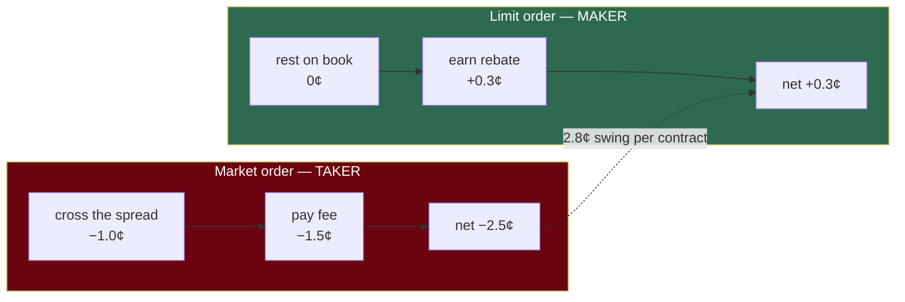

# Fees and spread — what a trade actually costs

**Question:** how much edge do you need before a trade is worth making?

This was missing from the original project brief, and it's large enough to change conclusions.

At $p=0.50$, per contract. That swing is comparable to the entire edge being hunted — which is why the executor has no market-order code path at all.

## The fee formula

$$
\text{fee} = \Theta \cdot C \cdot p \cdot (1 - p)
$$

$C$ = contracts, $p$ = price, $\Theta$ = the coefficient:

| Role | $\Theta$ | Per 100 contracts at $p=0.50$ |
|---|---|---|
| **Taker** (crosses the spread) | $+0.06$ | pays **\$1.50** |
| **Maker** (rests on the book) | $-0.0125$ | **earns \$0.31** |

The maker coefficient is **negative** — you get paid to provide liquidity.

## Why the $p(1-p)$ term

Fees are proportional to variance. A Bernoulli outcome at price $p$ has variance $p(1-p)$, maximised at $p = 0.50$ and vanishing at the extremes.

So fees are highest on coin-flip markets and near zero on lopsided ones. Trading a 0.95 favourite costs $0.06 \times 0.95 \times 0.05 = 0.0029$/contract — about a twentieth of the cost at 0.50.

Practical consequence: **the same edge is worth more at the extremes than in the middle.**

## The spread costs more than the fee

Measured on a real pregame WNBA book:

| Market | Bid | Ask | Spread |
|---|---|---|---|
| Total 185.5 | 0.51 | 0.53 | **2¢** |
| Moneyline | 0.85 | 0.86 | **1¢** |

Crossing a 2¢ spread costs 1¢ against mid. The taker fee at $p = 0.5$ adds 1.5¢. **Total ~2.5¢/contract**, against a mid of 0.52 — roughly **4.8% of notional**.

Your model needs to beat *that* before a trade makes money.

## Why limit orders only

Taking vs. making at $p = 0.50$:

| | Spread cost | Fee | Total |
|---|---|---|---|
| **Take** (market order) | −1.0¢ | −1.5¢ | **−2.5¢** |
| **Make** (resting limit) | 0 | +0.3¢ | **+0.3¢** |

A **2.8¢ swing per contract**. That is comparable to the entire edge being hunted.

This is why the executor exposes no market-order code path — not merely as slippage protection, but because taking liquidity inverts the economics. See [`/goal:executor`](../../.claude/commands/goal/executor.md).

The tradeoff: a resting order might not fill. That's a real cost, modelled in the backtest as fill probability and adverse selection.

## Slippage is not your problem (yet)

Measured depth at top-of-book:

| Market | Best-price depth |
|---|---|
| Total 185.5 | ~\$795 |
| Moneyline | ~\$7,452 |

At a **\$25–40 bankroll** you are ~1/20th of the *best price level alone*. You cannot move this market.

So the brief's "thin book, assume slippage" premise doesn't apply at current size. The binding constraints are spread and fees. This changes if the bankroll grows by two orders of magnitude.

## The minimum edge

To be worth trading as a maker, edge must exceed fee plus a margin for model error:

$$
\text{edge}_{\text{required}} > \underbrace{\Theta_{\text{maker}} \cdot p(1-p)}_{\text{negative — helps}} + \underbrace{\text{margin}}_{\text{model error}}
$$

Since the maker term is negative, the binding constraint is **model error**, not fees. Given the edge estimate comes from an unvalidated model, that margin should be large — this is the same logic behind fractional Kelly in [kelly.md](kelly.md).

**Always compute edge net of fees.** Sizing on gross edge means systematically over-betting.
