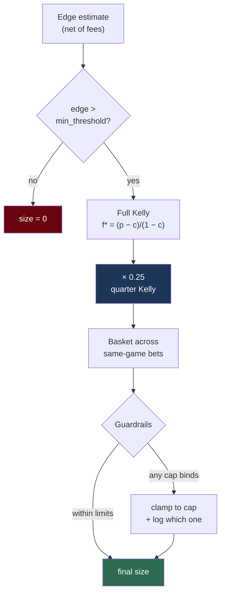

# Kelly sizing

**Question:** given an edge, how much do you bet?

Kelly is a ceiling, never a floor — whichever constraint is smallest wins.

## The criterion

Kelly maximises the expected logarithm of wealth — equivalently, the long-run geometric growth rate:

$$
f^* = \frac{bp - q}{b}
$$

$p$ = win probability, $q = 1-p$, $b$ = net odds received.

For a binary contract bought at price $c$ paying \$1: $b = \frac{1-c}{c}$, which simplifies to

$$
f^* = \frac{p - c}{1 - c}
$$

Buy at 0.52 with a true 0.57 probability: $f^* = \frac{0.05}{0.48} \approx 10.4\%$ of bankroll.

## Why we bet a quarter of that

Full Kelly is growth-optimal **only if your edge estimate is exact.** Ours is not — it comes from an unvalidated model with an n=2 manual sample behind it.

Kelly is brutally asymmetric to overestimation:

| Actual bet | Growth vs. optimal | Risk |
|---|---|---|
| Half Kelly | 75% | Much lower variance |
| Full Kelly | 100% | ~50% drawdowns routine |
| **Double Kelly** | **0%** | **Ruin** |

Betting twice the optimal fraction has **zero** expected growth. So if you think your edge is 10% and it's really 5%, full Kelly on the wrong number is double Kelly on the right one — you've wagered your bankroll for nothing.

Fractional Kelly buys insurance against being wrong about the input. At $\lambda = 0.25$ you keep ~44% of theoretical growth for a fraction of the variance.

**Default: quarter Kelly.** $f = 0.25 \cdot f^*$

## Correlation — the part most implementations get wrong

Kelly assumes independent bets. Bets on the same game are not.

Moneyline-favourite and Over are positively correlated: a blowout tends to move both. Sizing each at quarter Kelly gives combined exposure well above quarter Kelly on the underlying risk.

Worse, **ladder rungs are nearly the same bet.** Over 176.5 and Over 179.5 have correlation ~0.95. Betting both at "quarter Kelly each" is half Kelly on one position.

So:
- Size all positions in one game as a **single basket**
- Cap total game exposure (default: the Kelly size of the single best edge in that game)
- Treat same-side ladder rungs as ~perfectly correlated

For correlated bets the multivariate solution requires the covariance matrix:

$$
\mathbf{f}^* = \Sigma^{-1} \boldsymbol{\mu}
$$

With ~250 games/season there isn't enough data to estimate $\Sigma$ reliably, so we use conservative fixed assumptions and **document that they're assumptions**. An unreliable covariance estimate is more dangerous than an honest conservative constant.

## Hard guardrails

Applied *after* Kelly, so a model bug can't produce a catastrophic bet:

| Guardrail | Purpose |
|---|---|
| `max_position_size_pct` | cap on any single position |
| `max_game_exposure_pct` | cap across one game |
| `max_daily_exposure_pct` | cap deployed per day |
| `min_edge_threshold` | below this, edge is within model error |
| `min_bankroll` | stop trading below this |
| absolute dollar cap | final backstop |

Kelly is a *ceiling*, never a floor. If any guardrail binds, the smaller number wins, and the system logs which one bound.

## Reality check at a \$25–40 bankroll

Quarter Kelly on a 5% edge is roughly 2.5% of bankroll — **about \$1**. At `minimumTradeQty` of 0.01 contracts this is tradeable, but:

- Discreteness strains Kelly's continuous-fraction assumption
- Fees and spread (~2.5¢/contract taking) are large relative to \$1
- Variance dominates any real edge for a very long time

Kelly is a long-run growth argument. At this size the honest framing is that you're **validating a process**, not compounding capital.

## Edge must be net of fees

Always size on fee-adjusted edge. Using gross edge systematically over-bets — see [fees-and-spread.md](fees-and-spread.md).
