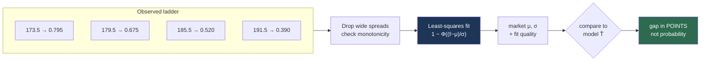

# Ladder curve fit

**Question:** the market quotes ~8 different total lines on one game. What does it collectively believe?



The payoff is the last box: "the market is 4 points high" is a claim you can check against basketball intuition. "Our probability is 5.8% higher" is not.

## The setup

Polymarket lists a **ladder** — separate markets on the same game at different thresholds:

| Line | Bid | Ask | Mid → $P(\text{Over})$ |
|---|---|---|---|
| 173.5 | 0.77 | 0.82 | 0.795 |
| 176.5 | 0.71 | 0.77 | 0.740 |
| 179.5 | 0.65 | 0.70 | 0.675 |
| 182.5 | 0.59 | 0.62 | 0.605 |
| 185.5 | 0.51 | 0.53 | 0.520 |
| 188.5 | 0.45 | 0.48 | 0.465 |
| 191.5 | 0.38 | 0.40 | 0.390 |
| 194.5 | 0.32 | 0.34 | 0.330 |

Each price is a point on the **survival function** of the total. Together they trace a distribution.

## Recovering the market's parameters

Assume the market's belief is normal, then find the $(\mu, \sigma)$ whose implied probabilities best match the observed ones:

$$
\min_{\mu, \sigma} \sum_{i} \left[ p_i - \left(1 - \Phi\!\left(\frac{\ell_i - \mu}{\sigma}\right)\right) \right]^2
$$

Solved numerically (`scipy.optimize`). Output: the market's implied mean and standard deviation, plus a fit quality measure.

## Why bother

Without this you're comparing a **point estimate** (your projected total, in points) against a **price** (0.52). Those aren't the same units, and the comparison is unintuitive.

After the fit, both sides are in points:

```
model projects:  181.2
market implies:  185.4
gap:              -4.2 points
```

"The market is 4 points high" is a claim you can sanity-check against basketball intuition. "Our probability is 5.8% above the market's" is not.

It also lets one number — the implied mean — summarise eight noisy prices, which is more robust than trusting any single rung.

## Data quality guards

Real books misbehave, and a bad rung will drag the fit:

**Filter wide spreads.** One observed rung quoted `bid 0.03 / ask 0.39`. The mid is meaningless. Drop rungs wider than ~10¢.

**Enforce monotonicity.** $P(\text{Over})$ must be non-increasing as the line rises — Over 176.5 cannot be less likely than Over 179.5. A violation means stale quotes. Flag and drop, or refuse the fit.

**Require enough rungs.** Two points fit a two-parameter model exactly and tell you nothing. Require ≥4.

**Report fit quality.** If R² is poor the ladder isn't normal-shaped and the implied mean shouldn't be trusted. Surface it rather than silently returning a number.

## Interpreting the two parameters

The fit returns both, and disagreements mean different things:

- **μ differs from your projection** → directional disagreement about the score. This is the tradeable signal.
- **σ differs from yours** → disagreement about *uncertainty*. A market σ far from the historical 17.3 suggests it's pricing something you don't know (injury, weather, rest). Treat a large σ gap as a reason for caution, not an opportunity.

That second case is the useful diagnostic: it's often the model being wrong rather than the market.

## Limitation

Fitting a normal to a ladder assumes the market's belief *is* normal. If the market prices a bimodal outcome — a star's availability decided at tip-off, say — no $(\mu, \sigma)$ fits well. The fit-quality metric is what catches this, which is why it's reported rather than discarded.
