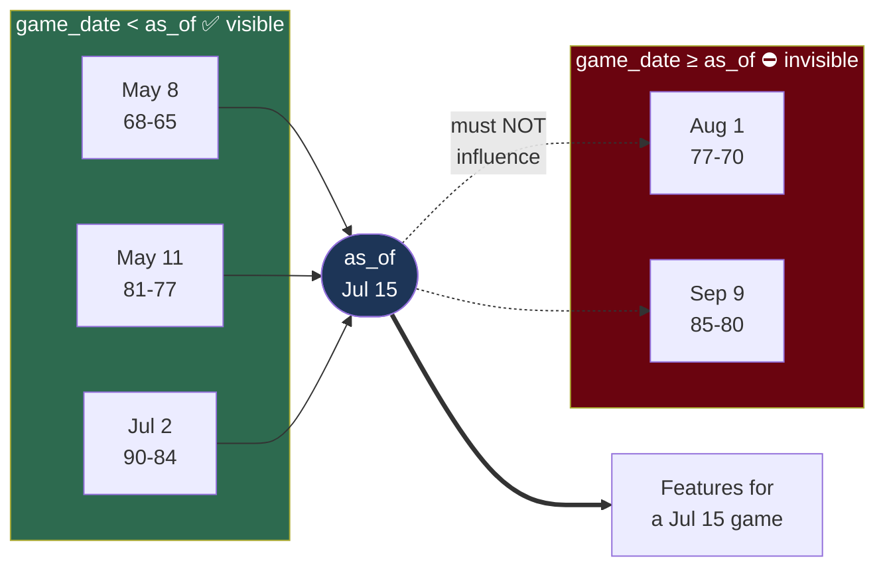

# Point-in-time correctness

**Question:** how do you guarantee a backtest never sees the future?

This is the single easiest way to produce a beautiful, worthless backtest.



The whole design exists to make the dotted arrows impossible to draw in code.

## The failure mode

Lookahead bias is dangerous because it's **silent and flattering**. A model that accidentally sees future data doesn't crash — it produces excellent results that evaporate on live money.

The classic version here would be storing season aggregates:

```
team_season_stats
  team_id | season | offense_ppg | defense_ppg
  9       | 2026   | 84.2        | 79.1        <- overwritten nightly
```

Backtest a July 15 game, read `offense_ppg = 84.2` — but that value was computed in **September**, from games that hadn't happened yet on July 15. The model appears to predict games using information from their own future. Results look plausible and mean nothing.

## The structural fix

**Store immutable per-game rows. Never store aggregates.**

```
team_game_logs
  game_date  | team_id | points_scored | points_allowed | season_type
  2026-05-08 | 9       | 68            | 65             | 2
  2026-05-11 | 9       | 81            | 77             | 2
```

Every statistic is then *derived* at query time:

```sql
SELECT avg(points_scored)
FROM team_game_logs
WHERE team_id = :team AND game_date < :as_of AND season_type = 2
```

The `as_of` filter is the guarantee. There is no stored number that *could* contain future information, because no number is stored at all.

This is why there is deliberately **no** `team_season_stats` table. The bug isn't discouraged by convention — it's unwritable.

## `as_of` is mandatory

```python
def build_features(team_id: int, as_of: datetime, session) -> TeamFeatures:
    """Every stat computed ONLY from games with game_date < as_of."""
```

`as_of` has **no default**. It never falls back to `now()`. There is no code path that computes "current stats," because such a path would be the exact thing that's unsafe in a backtest.

Cost of this design: none. ESPN returns a full season per call, so storing per-game rows is no more work than storing aggregates.

## Testing it

The guarantee is only real if tested. The key test:

```python
def test_no_lookahead():
    before = build_features(team_id=9, as_of=july_15)
    insert_game(date=august_1, ...)          # a game from the future
    after = build_features(team_id=9, as_of=july_15)
    assert before == after                    # must be byte-identical
```

If inserting a future game changes a past feature vector, there's a leak.

Related invariants worth pinning:
- Determinism — same inputs, same output, always
- No `datetime.now()` anywhere in the model path
- No network calls during prediction (a live API returns *today's* data)

## Walk-forward

The backtest steps through time, never fitting on data after the game being predicted:

```python
for game in sorted(games, key=lambda g: g.start_time):
    features = build_features(team_id, as_of=game.start_time)
    prediction = model.predict(features)
    record(prediction, actual=game.outcome)
```

Any fitted parameter — the record coefficient $\beta$, the Pythagorean exponent $k$ — must be refit inside this loop using only prior data. Fitting $k$ on the full history and then "walking forward" leaks in a subtler way: the parameter itself encodes the future.

## Where lookahead sneaks in anyway

Even with the above, watch for:

1. **Fitted constants from the whole sample.** Our $k = 11.09$ and σ = 17.3 were fitted on 2023–2025. Using them to backtest 2024 leaks. Refit walk-forward, or treat those runs as in-sample.
2. **Survivorship in team lists.** Fetching "current teams" and backfilling misses relocated or defunct franchises.
3. **Revised data.** If a source corrects a box score, you get the corrected version, not what was known then. Minor for scores, serious for injury reports.
4. **Market snapshots.** Recording at 7pm and comparing to a 7:30 line is lookahead. Always compare a prediction to the market state at *its own* timestamp — which is why `predictions` stores `market_bid`/`market_ask` at prediction time rather than joining later.

## Why this earns its strictness

Every hour spent on lookahead prevention is cheaper than a backtest you believe and shouldn't. The failure isn't losing money on a bad model — it's *not knowing* the model is bad, and scaling it up.
