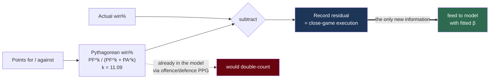

# Win-loss record and the Pythagorean residual

**Question:** does a team's record tell you anything its point differential doesn't?

Short answer, from our own data: **almost certainly not.** The feature is built anyway, in a form that lets the data say so.

Subtracting the Pythagorean expectation removes exactly the part the model already knows.

## The collinearity problem

Adding raw win% alongside offence/defence PPG double-counts. Win% is largely *determined* by point differential — teams that outscore opponents win. Two collinear features on a ~250-game season give unstable, uninterpretable coefficients.

But record isn't *purely* redundant. It also reflects close-game execution, clutch play, and luck. The goal is to isolate that part.

## Pythagorean expectation

Bill James' baseball formula, adapted to basketball, predicts win% from points alone:

$$
\widehat{W\%} = \frac{PF^{k}}{PF^{k} + PA^{k}}
$$

$PF$ = points for, $PA$ = points against.

**We fitted $k = 11.09$ on 2023–2025 WNBA data** (769 games, 37 team-seasons, regular season only; RMSE 0.049 win%).

> The NBA's widely-quoted exponent is ~13.91. **Do not reuse it.** A different $k$ meaningfully changes the residual, and the WNBA value is materially lower.

## The residual is the feature

$$
r = W\%_{\text{actual}} - \widehat{W\%}_{\text{pythagorean}}
$$

By construction this is the part of record that point differential **cannot** explain — close-game execution, clutch performance, and luck. It's near-orthogonal to the PPG features already in the model, so it can be added as a modifier without double-counting.

Applied to the projected margin:

$$
\hat{M} \mathrel{+}= \beta \cdot (r_A - r_B) \cdot w_{\text{playoff}}
$$

**$\beta$ is fitted walk-forward, never hand-set.** That matters — see below.

## The uncomfortable result

Testing whether the residual reflects *skill* rather than *luck*:

| Quantity | Value |
|---|---|
| Observed residual σ across team-seasons | **0.049** (4.9 win-% pts) |
| Binomial noise σ for a 40-game season | **0.079** (7.9 win-% pts) |
| Implied true-skill variance | **negative** |

If observed variance decomposes as

$$
\sigma^2_{\text{observed}} = \sigma^2_{\text{skill}} + \sigma^2_{\text{luck}}
$$

then $\sigma^2_{\text{skill}} = 0.049^2 - 0.079^2 < 0$.

**The spread in teams' clutch performance is smaller than chance alone would produce.** There is no measurable persistent close-game skill in this sample. Over a 40-game season, luck alone swings a team's record by ~3.2 games — larger than the entire effect we'd be trying to measure.

(Caveat: $k$ was fitted in-sample on these same team-seasons, which shrinks residuals somewhat. The conclusion is robust to that — the gap is not close.)

This matches the broader sports-analytics literature: "clutch" ability is mostly a narrative applied to variance after the fact.

## So why build it

Three reasons:

1. **Fitting $\beta$ from data means a noise feature costs nothing.** If there's no signal, $\beta \to 0$ and the model is unchanged. The risk of including it is near zero; the risk of *hand-setting* it would be real.
2. **Settling it empirically beats settling it by assertion.** The backtest runs with and without the modifier and reports $\beta$ with a confidence interval.
3. **A null result is information.** "Record adds nothing beyond point differential in the WNBA" is a defensible finding, and it closes off a whole family of tempting features.

**Do not hand-tune $\beta$ to make this look productive.**

## Playoff down-weighting

Regular-season record loses predictive value in the playoffs: seeding is locked, rotations tighten, motivation shifts, and a short series differs from a long grind.

So $w_{\text{playoff}} = 0.25$ (configurable) and the prediction is flagged `reduced_confidence`.

Detection is exact — ESPN's `seasonType.id = 3` — not a date heuristic.

**Why down-weight rather than fit a playoff-specific $\beta$:** the WNBA postseason is ~15–20 games/season. There is nowhere near enough data to fit playoff-specific behaviour. A configurable down-weight plus an honest confidence flag is the defensible choice.

## Scope limits

- **Applied to spread and moneyline only.** Clutch execution shifts the *margin* distribution; it has no mechanism for moving a game's combined score. Totals are untouched.
- **Regular-season games only** feed the record calculation (`season_type = 2`). Preseason is excluded everywhere; postseason doesn't count toward record.
- **Does not capture strength of schedule.** That needs opponent-adjusted PPG — a separate, larger change. The residual is about close games, not opponent quality.
